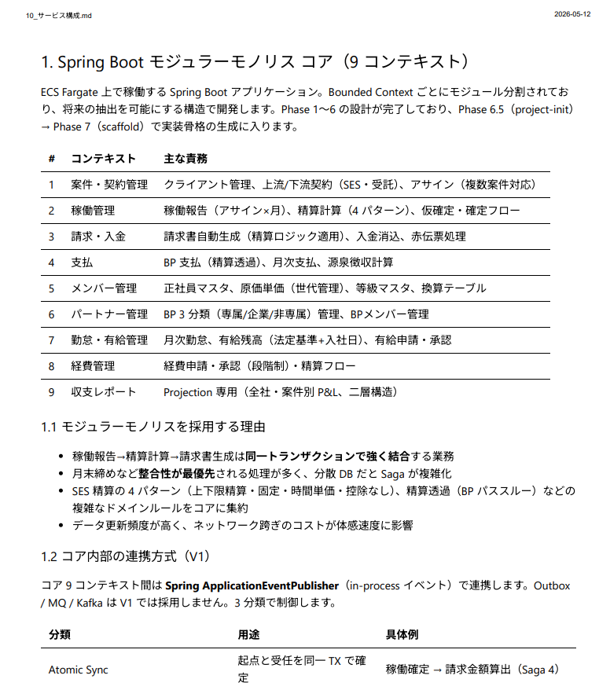
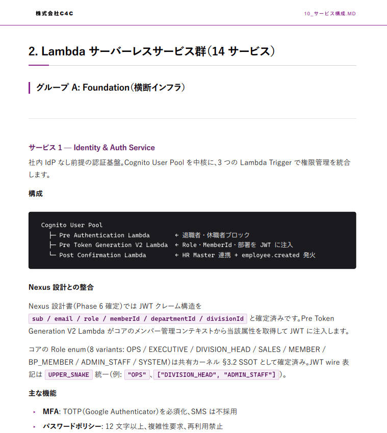

<div align="center">

<br>


<br>

# `markdown-c4c`

### Swiss Modern Minimal Document Design System

`v5.1.0`　·　`#8A248C`　·　`#888888`　·　`#040104`

<br>

Markdown だけで、**ブランド統一されたクライアント品質の PDF** を量産する。
Claude / VS Code / Markdown PDF の 3 つを繋ぐ、株式会社C4C の標準ドキュメントシステム。

<br>

[](./CHANGELOG.md)
[](./LICENSE)
[](https://marketplace.visualstudio.com/items?itemName=yzane.markdown-pdf)
[](https://claude.com/claude-code)
[](./markdown-c4c-web-v1.0.0)

<br>

</div>

---

<div align="center">

<table>
<tr>
<td width="50%"></td>
<td width="50%"></td>
</tr>
<tr>
<td align="center"><sub><b>COVER + TABLE OF CONTENTS</b><br>クリック遷移可能な目次（ページ番号なし）</sub></td>
<td align="center"><sub><b>CALLOUT 5 VARIANTS</b><br>NOTE · TIP · INFO · 注意 · 重要</sub></td>
</tr>
</table>

> 全コンポーネントギャラリーは **[`docs/screenshots/gallery/`](docs/screenshots/gallery/)** を参照。

</div>

<br>

---

<br>

## ▍ What's new in v5.1.0

- **判断ガイド集としての reference.md 全面再設計** — `docs/markdown-c4c-reference.md` に「生成判断フロー」「Q&A の流れ図」「ドキュメント種別ごとの構成バリエーション（7 種別 × 2-3 パターン）」「コンポーネント組み合わせ NG 集」を追加。 「同じ顔のドキュメント」量産を防ぐ
- **SKILL.md セクション 3.0 を 5 フェーズ Q&A ワークフローに拡張** — 基本 5 項目 + 種別ごとの追加質問（3-5 問）+ コンポーネント提案フェーズ + 構成バリエーション提示 + 生成後 AI 臭セルフチェック 7 項目
- **ロゴ画像配置案内ルール（セクション 3.5）新設** — ロゴ画像を含む md を生成完了したら、 macOS / Windows 両 OS の格納先と修正必要箇所を骨組みとして自動提示
- **コンポーネント見出しを日本語表記で統一** — `5.1 Callout` → `5.1 コールアウト（Callout）`、 `5.5 Stats / KPI` → `5.5 数値カード（Stats / KPI）` など全 19 項目
- **配布物ミラー新設** — `skill/references/` に判断ガイドと表紙・締めページプレビューの Markdown 正本を同梱

詳しくは [`CHANGELOG.md`](./CHANGELOG.md) と [`RELEASE-v5.1.0.md`](./RELEASE-v5.1.0.md) を参照。

<br>

---

<br>

## ▍ What is `markdown-c4c`

社内資料・クライアント提案書・設計書・仕様書・報告書・議事録・API ドキュメント — そのすべてを **Markdown 1 ファイル** で、**株式会社C4C のブランドガイドラインに完全準拠した PDF** として生成するシステム。

Word / PowerPoint / Illustrator は使わない。Claude にお願いするか、テンプレを少し編集するだけ。出力はいつも同じクオリティーで、フォントもカラーもレイアウトも揺れない。

<br>

<table>
<tr>
<td width="33%">
<sub><b>FOR CLAUDE CODE</b></sub><br><br>
スキルとして自動呼出。 トリガー語を含む依頼で Claude が自動でこのスタイルを使う。
</td>
<td width="33%">
<sub><b>FOR CLAUDE WEB</b></sub><br><br>
無料版でも使える配布パッケージ <code>markdown-c4c-web-v1.0.0</code> を同梱。 社内へ ZIP で配布可能。
</td>
<td width="33%">
<sub><b>FOR DESIGNERS</b></sub><br><br>
CSS 変数 3 行を差し替えれば、別ブランドへの転用も可能。 Swiss Modern Minimal をベースに完全カスタム可。
</td>
</tr>
</table>

<br>

---

<br>

## ▍ Quick Start — コーディング知識ゼロで使う

開発者でなくても 3 ステップで導入できる。 Git も npm も使わない、ZIP ベースの導入手順。

<table>
<tr>
<td width="33%" valign="top">

##### STEP 1
**ZIP をダウンロード**

[`markdown-c4c-v5.1.0.zip`](./markdown-c4c-v5.1.0.zip) をリポジトリから直接 DL（Download raw file）、または [Releases](https://github.com/SarojSeenuan/skill-markdown-c4c/releases) からアセット取得。

</td>
<td width="33%" valign="top">

##### STEP 2
**Claude Web に登録**

ZIP を解凍せずに、Claude Web（[claude.ai](https://claude.ai)）の **サイドバー → カスタマイズ → スキル** からそのまま登録。

</td>
<td width="33%" valign="top">

##### STEP 3
**VS Code で PDF 化**

VS Code に `Markdown PDF` 拡張を入れて、Claude が生成した `.md` を右クリック → `Export (pdf)`。

</td>
</tr>
</table>

> 詳しい手順は **[`markdown-c4c-web-v1.0.0/README.md`](markdown-c4c-web-v1.0.0/README.md)** と **[`markdown-c4c-web-v1.0.0/pdf-setup/README-PDF-SETUP.md`](markdown-c4c-web-v1.0.0/pdf-setup/README-PDF-SETUP.md)**（Windows / macOS / Linux 対応・画面キャプチャ付き）にて。

開発者向けの自動インストールは [Install — Claude Code](#-install--claude-code) を参照。

<br>

---

<br>

## ▍ Case Study — Before / After

「同じ Markdown を、CSS を変えるだけで」どこまで変わるか。

<table>
<tr>
<th align="center" width="33%">BEFORE — Default</th>
<th align="center" width="33%">AFTER — markdown-c4c v3.5</th>
<th align="center" width="33%">AFTER — markdown-c4c v3.5 (alt)</th>
</tr>
<tr>
<td></td>
<td></td>
<td></td>
</tr>
</table>

詳細解説 **[`docs/case-studies/01-introduction.md`](docs/case-studies/01-introduction.md)**

<br>

---

<br>

## ▍ Components — v3.5 Lineup

ドキュメントの「型」を意識せず書き始められる 20+ のコンポーネント。 デザイナーが手で起こすレベルの仕上がりを、Markdown + クラス指定だけで実現。

<table>
<tr>
<th align="left" width="180">CATEGORY</th>
<th align="left" width="80">COUNT</th>
<th align="left">VARIANTS</th>
</tr>
<tr><td><code>Callout</code></td><td>5</td><td>NOTE · TIP · INFO · 注意 · 重要</td></tr>
<tr><td><code>Shape Box</code></td><td>5</td><td>standard · filled · outline · brand · data-title</td></tr>
<tr><td><code>Divider</code></td><td>9</td><td>hairline · double · dot 系 6 種 · brand 菱形</td></tr>
<tr><td><code>Table</code></td><td>5</td><td>枠線あり · no-borders · compact · jp · wrap</td></tr>
<tr><td><code>Stats / KPI</code></td><td>8 accent</td><td>red · green · blue · brand · amber · orange · pink · gray</td></tr>
<tr><td><code>Timeline</code></td><td>3 state</td><td>done · active · pending（CSS counter で自動採番）</td></tr>
<tr><td><code>Pull Quote</code></td><td>2</td><td>標準 · brand</td></tr>
<tr><td><code>Comparison</code></td><td>2 col</td><td>BEFORE / AFTER カード</td></tr>
<tr><td><code>Bar Chart</code></td><td>2 axis</td><td>横バー · 縦バー（intensity 透明度で値の大小表現）</td></tr>
<tr><td><code>Line Graph</code></td><td>2 line</td><td>実線 + 破線 + 凡例（SVG ベース X/Y 軸）</td></tr>
<tr><td><code>Feature List</code></td><td>2</td><td>標準 · brand（インライン SVG アイコン推奨・絵文字禁止）</td></tr>
<tr><td><code>Person Card</code></td><td>—</td><td>avatar + name + role + body + meta</td></tr>
<tr><td><code>Pricing Table</code></td><td>2</td><td>標準 · featured（RECOMMENDED バッジ自動）</td></tr>
<tr><td><code>API Blueprint</code></td><td>7 method</td><td>GET · POST · PUT · PATCH · DELETE · HEAD · OPTIONS</td></tr>
<tr><td><code>TOC</code></td><td>—</td><td>クリック遷移可能（ページ番号なし · 実 PDF と必ずズレるため）</td></tr>
<tr><td><code>Code Block</code></td><td>—</td><td>One Dark Pro + ファイル名ヘッダ対応</td></tr>
</table>

詳細スニペット **[`skill/references/components.md`](skill/references/components.md)**

<br>

---

<br>

## ▍ Brand System

<table>
<tr>
<th align="left" width="200">TOKEN</th>
<th align="left" width="120">HEX</th>
<th align="left">ROLE</th>
</tr>
<tr>
<td><code>--brand-primary</code></td>
<td><code>#8A248C</code></td>
<td>マゼンタパープル · アクセント 1 点のみ</td>
</tr>
<tr>
<td><code>--brand-secondary</code></td>
<td><code>#888888</code></td>
<td>ミディアムグレー · 補助テキスト · 罫線</td>
</tr>
<tr>
<td><code>--brand-ink</code></td>
<td><code>#040104</code></td>
<td>インクブラック · 本文 · 最強罫線</td>
</tr>
</table>

#### Typography Stack
- **Display** — `Inter Tight` / 数字 tabular nums
- **Body** — `Manrope`
- **Monospace** — `JetBrains Mono` / `SF Mono`
- **Japanese** — `Hiragino Kaku Gothic ProN` / `Yu Gothic`

#### Grid System
- A4 縦 · margin `24mm / 20mm`
- Spacing tokens `--sp-1` 〜 `--sp-8`（4px → 64px）
- ヘアライン `0.5pt` ベース · 強調罫線 `2pt`

CSS の `:root` 内 3 行を差し替えるだけで別ブランドにも完全転用可能。

<br>

---

<br>

## ▍ Install — Claude Code

#### A. ワンライナーインストールスクリプト（推奨）

**Windows (PowerShell):**
```powershell
irm https://raw.githubusercontent.com/SarojSeenuan/skill-markdown-c4c/main/scripts/install.ps1 | iex
```

**macOS / Linux:**
```bash
curl -fsSL https://raw.githubusercontent.com/SarojSeenuan/skill-markdown-c4c/main/scripts/install.sh | bash
```

#### B. 手動 `git clone`

```bash
git clone https://github.com/SarojSeenuan/skill-markdown-c4c.git ~/c4c-skill
cd ~/c4c-skill
./scripts/install.sh           # macOS / Linux
.\scripts\install.ps1          # Windows
```

#### C. `npx skills`（[npm `skills` パッケージ](https://www.npmjs.com/package/skills) 経由 · 実験的）

```bash
# プロジェクトローカル
npx skills add SarojSeenuan/skill-markdown-c4c

# グローバル（ユーザー全体）
npx skills add SarojSeenuan/skill-markdown-c4c --global
```

> `npx skills` は通常 `skills/<name>/SKILL.md` または root の `SKILL.md` を検出する仕様。 本リポジトリは `skill/`（単数形）配下に置いているため、検出に失敗した場合は **A. インストールスクリプト** または **D. ZIP** 方式に切り替えてください。

#### D. ZIP 配布から手動展開（Claude Web 用）

リポジトリ直下にある [`markdown-c4c-v5.1.0.zip`](./markdown-c4c-v5.1.0.zip) を Claude Web のサイドバー → カスタマイズ → スキルにそのままアップロード。 自分で再ビルドする場合は `scripts/build-zip.ps1`（Windows）または `scripts/build-zip.sh`（macOS / Linux）を実行。

インストールスクリプトは以下に必要ファイルを自動配置:
- `~/.claude/skills/markdown-c4c/`
- `~/.claude/commands/markdown-c4c.md`
- `~/.claude/styles/markdown-pdf.css`
- `~/.claude/rules/{jp-fix-checklist,markdown-generation}.md`

<br>

---

<br>

## ▍ Install — Claude Web 無料版（非開発者向け）

Claude Web の無料アカウントだけで使える、ZIP ベースのインストール手順。 **Git / npm / コマンドライン不要**。

#### ステップ 1: ZIP を取得

以下のいずれかで `markdown-c4c-v5.1.0.zip` を入手:

- **GitHub から直接ダウンロード**（最も簡単 · コマンド不要）
  - リポジトリトップで `markdown-c4c-v5.1.0.zip` をクリック → 右上の **「Download raw file」** ボタン
  - または直接 URL: `https://github.com/SarojSeenuan/skill-markdown-c4c/raw/main/markdown-c4c-v5.1.0.zip`
- **GitHub Releases から**: [Releases](https://github.com/SarojSeenuan/skill-markdown-c4c/releases) ページの v5.1.0 リリースのアセット欄
- **開発者から直接受け取る**: 社内 Slack / メールで ZIP を共有してもらう

#### ステップ 2: Claude Web に登録

1. [claude.ai](https://claude.ai) にログイン
2. **サイドバー → カスタマイズ → スキル** を開く
3. **スキルを追加** ボタンを押す
4. 受け取った `markdown-c4c-v5.1.0.zip` をそのままドラッグ＆ドロップ（解凍不要）
5. 登録完了。 以降の会話で「Markdown で書いて」「提案書まとめて」と頼むと自動で発動

#### ステップ 3: VS Code で PDF 化（任意）

PDF にしたい場合は [VS Code](https://code.visualstudio.com/) と `Markdown PDF` 拡張を入れる。 詳しい手順は画面キャプチャ付きの [`markdown-c4c-web-v1.0.0/pdf-setup/README-PDF-SETUP.md`](markdown-c4c-web-v1.0.0/pdf-setup/README-PDF-SETUP.md) を参照。

#### 配布物の中身

```
markdown-c4c-v5.1.0.zip
└── markdown-c4c/
    ├── SKILL.md                       ← Claude Web が読むスキル本体（自己充足型）
    ├── README.md                      ← スキル概要
    ├── assets/
    │   ├── template-document.md         · スタータードキュメント（表紙 + 締めページ付き）
    │   ├── markdown-pdf.css              · Swiss Modern v3.5 スタイル定義
    │   ├── jp-fix-checklist.md           · 日本語 8 項目セルフチェック
    │   ├── markdown-generation.md
    │   ├── setup-vscode-settings.json
    │   └── c4c-logo.png
    └── references/
        └── components.md                · 全コンポーネント詳細ギャラリー
```

> Claude Web 配布版の独立 README は **[`markdown-c4c-web-v1.0.0/README.md`](markdown-c4c-web-v1.0.0/README.md)** にも残っている（移行期間中の参考用）。

<br>

---

<br>

## ▍ Prerequisites

#### Claude Code 版

```bash
# Claude Code（最新版） — https://claude.com/claude-code

# VS Code Markdown PDF 拡張
code --install-extension yzane.markdown-pdf
```

インストール後、VS Code の `settings.json` に `skill/assets/setup-vscode-settings.json` の内容をマージ（CSS パスは各自のホームに調整）。

#### Claude Web 版

- Claude Web 無料アカウント（[claude.ai](https://claude.ai)）
- VS Code + `yzane.markdown-pdf` 拡張
- [Windows / macOS / Linux] OS は不問

<br>

---

<br>

## ▍ Usage

#### 自動呼出（推奨）

Markdown 生成のトリガー語を含む依頼で、Claude が自動でこのスキルを参照します。

```
社内向けプロジェクト報告書を Markdown で作って
```

> トリガー語: Markdown · ドキュメント · 提案書 · 仕様書 · 報告書 · 議事録 · README · 設計書 · 見積書 · `.md` 編集

#### スラッシュコマンド

```
/markdown-c4c 新サービス提案書 v1.0
```

引数にタイトル or 要件を渡せます。

#### テンプレートから手動開始

`skill/assets/template-document.md` を雛形としてコピー → 編集 → VS Code で右クリック → `Markdown PDF: Export (pdf)`。

<br>

---

<br>

## ▍ Header / Footer Defaults

| 位置 | 内容 |
|:---|:---|
| **ヘッダ左** | `株式会社C4C`（縦バー · uppercase · letter-spacing 0.18em） |
| **ヘッダ右** | ドキュメント `<title>`（ブランド色） |
| **ヘッダ下** | `0.5pt` のブランドカラー水平罫線 |
| **フッタ左** | 空（バージョンは本文の caption 行に動的に記載） |
| **フッタ右** | `現在 / 総数`（例: `6 / 15` · tabular nums） |

#### バージョン表記の動的指定

ドキュメントタイトル直下の `caption` 行で柔軟に変えられます:

```markdown
<div class="caption">Author: 担当者名　·　Version: v2.3 · FINAL　·　Date: 2026-05-22</div>
```

#### 組織名の切替

| 指示 | 対応 |
|:---|:---|
| 何も言われない | `株式会社C4C`（デフォルト） |
| 「個人名で」「○○ で」 | `settings.json` の `header-org` を指定された名前に書き換える差分提示 |

<br>

---

<br>

## ▍ Repository Structure

```
skill-markdown-c4c/
├── README.md                              ← このファイル
├── CHANGELOG.md                           ← Keep a Changelog 形式
├── LICENSE                                ← MIT
├── package.json                           ← npx skills メタデータ
│
├── skill/                                 ▍ Claude Code 用スキル本体
│   ├── SKILL.md                              · 自動呼出トリガー定義
│   ├── README.md                             · スキル単体ドキュメント
│   ├── command.md                            · /markdown-c4c コマンド定義
│   ├── assets/                               ▍ 配布アセット
│   │   ├── markdown-pdf.css                     · Swiss Modern v3.5 CSS
│   │   ├── markdown-generation.md               · 生成ルール
│   │   ├── jp-fix-checklist.md                  · JP Fix 8 項目
│   │   ├── setup-vscode-settings.json           · VS Code 設定スニペット
│   │   └── template-document.md                 · スタータードキュメント
│   └── references/
│       └── components.md                     · 全コンポーネントギャラリー
│
├── markdown-c4c-web-v1.0.0/               ▍ Claude Web 無料版用配布パッケージ
│   ├── README.md                             · パッケージ概要
│   ├── SKILL.md                              · Claude Web 登録用
│   ├── assets/                               · テンプレート + ギャラリー + JP Fix
│   └── pdf-setup/                            · CSS + settings + 画像付き手順書
│
├── scripts/                               ▍ インストーラー
│   ├── install.sh                            · macOS / Linux
│   └── install.ps1                           · Windows PowerShell
│
├── docs/                                  ▍ ドキュメント
│   ├── articles/                             · ブログ記事 · 導入ストーリー
│   ├── case-studies/                         · Before / After 事例
│   └── screenshots/                          · プロモ画像 · ギャラリー
│
└── package.json
```

<br>

---

<br>

## ▍ Update

```bash
cd ~/c4c-skill
git pull
./scripts/install.sh             # or .\scripts\install.ps1
```

または `npx skills update` で全スキル一括更新。

<br>

---

<br>

## ▍ Uninstall

```bash
rm -rf ~/.claude/skills/markdown-c4c
rm ~/.claude/commands/markdown-c4c.md
# CSS と rules は他用途と共有の可能性あり — 手動判断
```

<br>

---

<br>

## ▍ Changelog

詳細 **[`CHANGELOG.md`](./CHANGELOG.md)**

<table>
<tr><th align="left" width="120">VERSION</th><th align="left">HIGHLIGHTS</th></tr>
<tr><td><code>v5.1.0</code></td><td>判断ガイド集として reference.md 全面再設計 · SKILL.md セクション 3.0 を 5 フェーズ Q&A ワークフローに拡張 · ロゴ画像配置案内ルール（3.5）新設 · コンポーネント見出し日本語化 · skill/references ミラー新設</td></tr>
<tr><td><code>v5.0.x</code></td><td>テンプレート全廃 + Q&A 必須化（5.0.0）· closing-page Editorial 再設計（5.0.3）· 円形 SVG アイコンバッジ標準化（5.0.4）· TOC 改ページ修正・watermark 拡大ほか</td></tr>
<tr><td><code>v4.0.0</code></td><td>cover/closing デザイン全面刷新 · フォント体系引き上げ · コンテンツ密度ルール · Q&A ワークフロー導入（最低 5 項目）</td></tr>
<tr><td><code>v3.5.0</code></td><td>OSS 化 · 個人情報完全除去 · ZIP ビルドスクリプト（Win/Mac/Linux）· 表紙テンプレート + 締めページ 4 パターン · SKILL.md 自己充足型（コンポーネント完全例コード集 + ドキュメント種別テンプレート 5 種 + version bump ルール）· cover/closing CSS クラス追加</td></tr>
<tr><td><code>v3.4.0</code></td><td>C4C ロゴ統合 · API Blueprint 仕上げ · README 全面刷新 · Claude Web 配布パッケージ初版 · JP Fix 句読点ルール追加</td></tr>
<tr><td><code>v3.3.1</code></td><td>API params テーブル余白修正 · Response Status の AI 臭デザインを GitHub Primer 風に刷新</td></tr>
<tr><td><code>v3.3.0</code></td><td>API Blueprint コンポーネント追加（HTTP method 7 色 · params 表 · status · example）</td></tr>
<tr><td><code>v3.2.0</code></td><td>Stat Card 刷新（縦バー + chevron + 8 accent 色）· Bar Chart 縦バージョン · Line Graph 追加 · Donut 削除 · Pricing 余白拡大 · Callout ラベル日本語化</td></tr>
<tr><td><code>v3.1.0</code></td><td>拡張コンポーネント 9 種追加（Stats / Timeline / Pull Quote / Comparison / Bar Chart / Feature List / Person / Pricing）</td></tr>
<tr><td><code>v3.0.0</code></td><td>Swiss Modern Minimal 全面リライト · Callout / Shape Box / Divider / Table / TOC · スラッシュコマンド · JP Fix 内蔵</td></tr>
</table>

<br>

---

<br>

## ▍ Philosophy

> **Clarity over cleverness.**
> 装飾ではなく、構造でクオリティーを保つ。
>
> **One source, many outputs.**
> Markdown 1 ファイルから、PDF · HTML · Print まで同じデザインで出る。
>
> **Designed, not generated.**
> AI らしいフォント・グラデ・左バーは使わない。 デザイナーの判断を CSS に込める。

<br>

---

<br>

## ▍ License

[MIT](./LICENSE) © 2026 Saroj Seenuan (Ken) / 株式会社C4C

<br>

<div align="center">

<br>

<sub>

`#8A248C` &nbsp; · &nbsp; `#888888` &nbsp; · &nbsp; `#040104`

</sub>

<br>

<sub><b>Designed by Saroj Seenuan (Ken) · Built for 株式会社C4C</b></sub>

<br><br>


</div>
