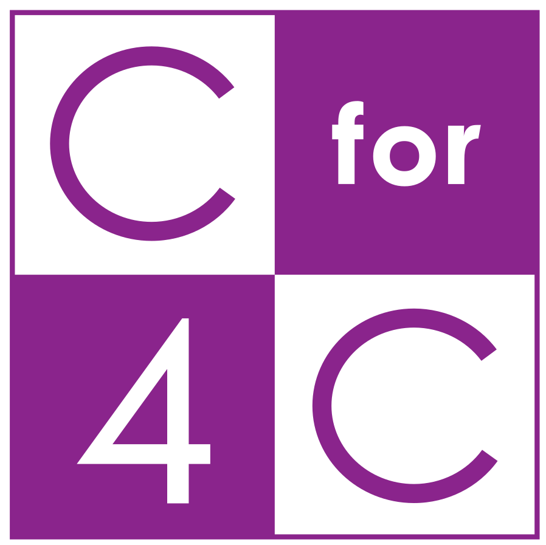

<head>
<title>Release Notes — markdown-c4c v3.5.0</title>
</head>

<div class="cover-page">
  <div class="cover-body">
    <span class="cover-eyebrow">RELEASE</span>
    <h1 class="cover-title">markdown-c4c<br>v3.5.0 Release Notes</h1>
    <p class="cover-subtitle">OSS 化・SKILL.md 自己充足型リライト・
ZIP 修復・表紙テンプレート + 締めページ 4 パターン・3 OS 対応</p>
  </div>
  <table class="cover-meta">
    <tr><th>VERSION</th><td>v3.5.0</td></tr>
    <tr><th>DATE</th><td>2026-04-29</td></tr>
    <tr><th>STATUS</th><td>RELEASED</td></tr>
    <tr><th>AUTHOR</th><td>株式会社C4C</td></tr>
  </table>
</div>

<div class="no-break">

# Release Notes — v3.5.0

<div class="caption">Version: v3.5.0 · RELEASED　·　Date: 2026-04-29　·　株式会社C4C</div>

<nav class="toc toc-no-page">
  <h2>Index</h2>
  <ol>
    <li><a href="#sec-highlights">ハイライト</a></li>
    <li><a href="#sec-zip">ZIP ビルドスクリプト</a></li>
    <li><a href="#sec-cover-closing">表紙テンプレート + 締めページ 4 パターン</a></li>
    <li><a href="#sec-self-contained">SKILL.md 自己充足型リライト</a></li>
    <li><a href="#sec-oss">OSS 化 — 個人情報の完全除去</a></li>
    <li><a href="#sec-cross-os">クロスプラットフォーム対応</a></li>
    <li><a href="#sec-footer">フッタ運用の統一</a></li>
    <li><a href="#sec-upgrade">アップグレード手順</a></li>
  </ol>
</nav>

</div>

<h2 id="sec-highlights">1. ハイライト</h2>

v3.5.0 は次の 3 つの大きな課題を同時に解決するリリースです。

1. **Web 配布 ZIP がアップロード時に「invalid characters」エラー**になる問題を修正
2. **個人情報を完全除去**して OSS として公開可能に
3. **SKILL.md を自己充足型**に刷新（Web 単体運用でもコンポーネント例・テンプレートに到達できる）

<h2 id="sec-zip">2. ZIP ビルドスクリプト</h2>

`scripts/build-zip.ps1`（Windows）と `scripts/build-zip.sh`（macOS / Linux）を新規追加。

- Anthropic skill validator が必須とする forward slash `/` セパレータで ZIP エントリを構築
- skill `name` と一致するルートフォルダ `markdown-c4c/` を強制
- SKILL.md frontmatter から `version` を読み取り、出力名 `markdown-c4c-vX.Y.Z.zip` を自動設定
- `__MACOSX` / `.DS_Store` / `Thumbs.db` / `.git` / `.pdf` を除外
- 生成後にエントリ名のバックスラッシュを自己検証してビルド失敗を即検知

旧 ZIP は `Compress-Archive` を使っていたためエントリパスに Windows バックスラッシュ `\` が入り込み、 Anthropic 側で「invalid characters」として弾かれていました。 専用スクリプトで再生成すれば確実にアップロード可能になります。

```powershell
# Windows
pwsh ./scripts/build-zip.ps1
```

```bash
# macOS / Linux
./scripts/build-zip.sh
```

<h2 id="sec-cover-closing">3. 表紙テンプレート + 締めページ 4 パターン</h2>

ドキュメントの 1 ページ目が caption 一行だけで真っ白になる問題と、最終ページが「— END OF DOCUMENT —」一行だけになる問題を、テンプレート化で解消しました。

### 3.1 表紙（cover-page）

```html
<div class="cover-page">
  <div class="cover-logo"></div>
  <hr class="cover-divider">
  <h1 class="cover-title">ドキュメントタイトル</h1>
  <p class="cover-subtitle">サブタイトル / 一行説明</p>
  <hr class="cover-divider">
  <table class="cover-meta">
    <tr><th>DOCUMENT</th><td>クライアント提案書</td></tr>
    <tr><th>VERSION</th><td>v1.0 · DRAFT</td></tr>
    <tr><th>DATE</th><td>YYYY-MM-DD</td></tr>
    <tr><th>AUTHOR</th><td>○○ ○○ / 役職</td></tr>
    <tr><th>RECIPIENT</th><td>株式会社○○ 御中</td></tr>
  </table>
  <p class="cover-footer muted center">株式会社C4C · https://c4c.co.jp</p>
</div>
<div class="page-break"></div>
```

> 注: v4.0.0 以降では `cover-logo` / `cover-divider` / `cover-footer` は廃止され、現在は `cover-eyebrow` + `cover-body` + `cover-meta` の構造に整理されています。 詳細は SKILL.md セクション 3 を参照してください。

### 3.2 締めページ 4 パターン

| パターン | 用途 |
|:---|:---|
| ① closing-message | C4C クレド + お礼（社外提案書のデフォルト） |
| ② closing-cta | 行動喚起（社外資料向け、社内資料では不要） |
| ③ closing-contact | 連絡先骨組み（個人名なしのプレースホルダ） |
| ④ closing-visual | ビジュアル + 名言（コーポレート向け） |

<h2 id="sec-self-contained">4. SKILL.md 自己充足型リライト</h2>

これまで Claude Web 配布版で SKILL.md 単体しか登録できない環境では、 `assets/components-gallery.md` を Claude が参照できず、コンポーネント例コードに到達できない問題がありました。

v3.5.0 では SKILL.md 本体に以下を内蔵:

- **コンポーネント完全例コード集**（14 種類すべて 表 + コード例 1 セット）
  - Callout 5 / Shape Box 5 / Divider 9 / Table 5 / Stats / Timeline / Pull Quote / Comparison / Bar Chart / Line Graph / Feature List / Person Card / Pricing / API Blueprint / インライン 6 種 / TOC / Code Block / 画像 3 パターン
- **ドキュメント種別テンプレート 5 種**
  - 提案書（外部・営業）/ 仕様書（内部・技術）/ 設計書（内部・技術）/ 工数見積書（外部・商談）/ README（OSS / 社内パッケージ）
  - 各種別ごとに TOC 骨格 + 推奨表紙 + 推奨締め + 推奨コンポーネントを定義
- **version bump 義務ルール** — SKILL.md を編集したら同一ターン内で必ずバージョンを bump する

> 注: v5.0.0 で「ドキュメント種別テンプレート 5 種」は完全廃止され、代わりに Q&A ワークフローが必須化されました。

<h2 id="sec-oss">5. OSS 化 — 個人情報の完全除去</h2>

| 旧 | 新 |
|:---|:---|
| `author: "Saroj Seenuan (Ken) / 株式会社C4C"` | `author: "株式会社C4C"` |
| LICENSE: `Copyright (c) 2026 Saroj Seenuan (Ken) / 株式会社C4C` | `Copyright (c) 2026 株式会社C4C` |
| `git clone https://github.com/SarojSeenuan/...` | `git clone <YOUR-REPO>/...` |
| サンプル人物名（Saroj / 田中 / 山田 / 佐藤 / 鈴木） | `○○ ○○` プレースホルダ |
| 個人パス（`C:\Users\kensu\.claude\...`） | 相対パス（`assets/...`）または 3 OS 別の例 |
| `ken@c4c.co.jp` | `name@c4c.co.jp` |
| 「Ken が日本語で書いた場合の応答すべてに適用」 | 「日本語で出力するすべての場面に適用」 |

<h2 id="sec-cross-os">6. クロスプラットフォーム対応</h2>

`pdf-setup/README-PDF-SETUP.md` と `how-to-export.md` を Windows / macOS / Linux 3 OS 対応に書き直し。

| 設定項目 | Windows | macOS | Linux |
|:---|:---|:---|:---|
| settings.json | `%APPDATA%\Code\User\settings.json` | `~/Library/Application Support/Code/User/settings.json` | `~/.config/Code/User/settings.json` |
| CSS 配置先 | `C:\c4c_works\markdown-c4c\` | `~/c4c_works/markdown-c4c/` | `~/c4c_works/markdown-c4c/` |
| パス書式 | `\\` で二重エスケープ | `/` で OK | `/` で OK |
| 和文フォント | 游ゴシック → MS ゴシック | Hiragino Kaku Gothic | Noto Sans CJK（要インストール） |

<h2 id="sec-footer">7. フッタ運用の統一</h2>

旧版に残っていた「フッタ = `v1.0 · DRAFT` + `現在 / 総数` 形式」という記述を完全削除しました。

新運用:

- **フッタ左は空のまま** — `<span class='footer-version'>` は空文字で固定
- バージョンは Markdown 本文の caption 行で動的指定

```markdown
<div class="caption">Author: ○○ ○○　·　Version: v2.3 · FINAL　·　Date: 2026-05-22</div>
```

ドキュメントごとに caption 行を書き換えるだけで版表記が変わるため、 settings.json を都度編集する必要がありません。

<h2 id="sec-upgrade">8. アップグレード手順</h2>

```bash
# 1. リポジトリを pull
git pull

# 2. ZIP を再生成（OS に応じて）
pwsh ./scripts/build-zip.ps1     # Windows
./scripts/build-zip.sh           # macOS / Linux

# 3. 生成された markdown-c4c-v3.5.0.zip を Claude Web の Skills に手動アップロード
```

旧 `markdown-c4c-web-v1.0.0.zip` は破棄してください（バックスラッシュ問題で弾かれます）。

<div class="closing-page closing-message">
  <p class="closing-thanks">最後までご覧いただき、誠にありがとうございました。</p>
  <p class="closing-credo">「カタチ」に残すだけじゃない、<br>「ココロ」に残る仕事を。</p>
  <p class="closing-org">株式会社C4C</p>
</div>
