<head>
<title>markdown-c4c Web 版 導入手順書</title>
</head>

<div class="cover-page">
  <div class="cover-body">
    <span class="cover-eyebrow">OVERVIEW</span>
    <h1 class="cover-title">markdown-c4c<br>Web 版 導入手順書</h1>
    <p class="cover-subtitle">Claude Web の無料アカウントと VS Code だけで、<br>株式会社C4C ブランド PDF を生成する環境を作る。</p>
  </div>
  <table class="cover-meta">
    <tr><th>FOR</th><td>完全初心者の方</td></tr>
    <tr><th>OS</th><td>Windows / macOS 対応</td></tr>
    <tr><th>VERSION</th><td>v1.0 · FINAL</td></tr>
    <tr><th>DATE</th><td>2026-05-24</td></tr>
    <tr><th>AUTHOR</th><td>株式会社C4C</td></tr>
  </table>
</div>

<div class="no-break">

# markdown-c4c Web 版 導入手順書

<div class="caption">Author: 株式会社C4C　·　Version: v1.0 · FINAL　·　Date: 2026-05-24</div>

Word しか触ったことがなくても進められるよう、画面キャプチャ付きで一手ずつ説明する。 所要時間は約 30 分。 完了すると Claude Web で書いた Markdown が、ブランド統一された PDF として手元に残るようになる。

<nav class="toc toc-no-page">
  <h2>Index</h2>
  <ol>
    <li><a href="#sec-overview">このパッケージの全体像</a></li>
    <li><a href="#sec-prep">事前準備</a></li>
    <li><a href="#sec-vscode">VS Code セットアップ</a></li>
    <li><a href="#sec-claude">Claude Web にスキルを登録</a></li>
    <li><a href="#sec-use">Claude Web でスキルを使ってみる</a></li>
    <li><a href="#sec-logo">C4C ロゴ画像の配置（任意）</a></li>
    <li><a href="#sec-pdf">VS Code で PDF 化</a></li>
    <li><a href="#sec-trouble">トラブルシュート</a></li>
  </ol>
</nav>

</div>

<h2 id="sec-overview">1. このパッケージの全体像</h2>

##### WHAT YOU GET

`markdown-c4c` は、Claude（AI）に **株式会社C4C のブランドガイドライン**に沿った Markdown ドキュメントを書いてもらうためのスキル。 提案書・仕様書・報告書・議事録・README・設計書・見積書など、社内外で使う文書を、デザインを気にせず中身に集中して書ける状態にする。

このパッケージを導入すれば、Word も Illustrator も使わずに、Markdown を書くだけで C4C 公式と同じクオリティーの PDF が完成する。

<div class="shape-box" data-title="DESIGN SYSTEM">
<p>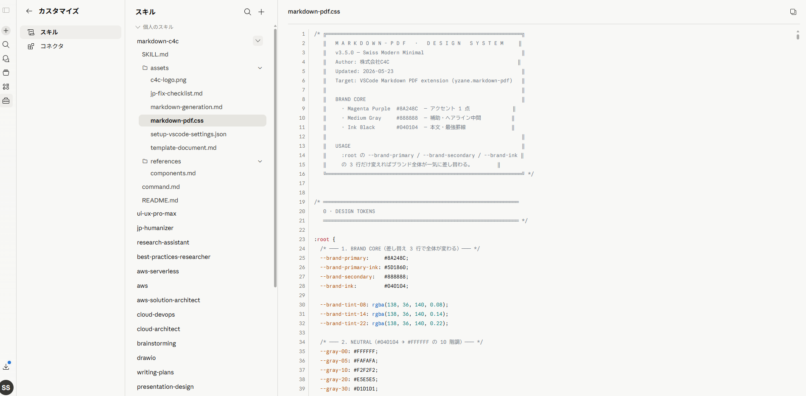</p>
<p><strong>Swiss Modern Minimal v5.1：</strong> ブランドカラー（マゼンタ <code>#8A248C</code> / グレー <code>#888888</code> / インク <code>#040104</code>）と厳密グリッドを軸にした、紙の提案書でも違和感のないモダンなデザインシステム。 Callout / Shape Box / Stats / Comparison など 19 種類のコンポーネントを内蔵している。</p>
</div>

### 3 ステップで完了する

1. **VS Code セットアップ** — PDF 化エンジンを手元に用意する（約 15 分）
2. **Claude Web にスキルを登録** — AI 側にブランドを覚えてもらう（約 5 分）
3. **使い始める** — Claude Web で生成 → VS Code で PDF 化（日常運用）

<h2 id="sec-prep">2. 事前準備</h2>

##### CHECKLIST

セットアップに必要なものは以下の 4 つ。 すべて無料。

- [ ] PC（Windows 10/11 もしくは macOS 12 以降）
- [ ] インターネット接続（VS Code・拡張機能・スキル ZIP のダウンロード用）
- [ ] Claude Web の無料アカウント（[claude.ai](https://claude.ai/) で取得）
- [ ] このパッケージの GitHub Release ページ（最新の `markdown-c4c-vX.Y.Z.zip` を取得する）

<div class="callout callout-info">
<p><strong>INFO：</strong> Windows と macOS のどちらでも手順は基本同じ。 違うのはファイルパスの書き方と一部ショートカットだけ。 該当箇所は OS 別に併記する。</p>
</div>

<h2 id="sec-vscode">3. VS Code セットアップ</h2>

##### PHASE 1

VS Code は無料のコードエディタ。 Markdown を PDF に変換する「Markdown PDF」拡張機能を入れるために、まずこれを準備する。

### 3.1 VS Code をダウンロードして起動

公式サイト [https://code.visualstudio.com/](https://code.visualstudio.com/) を開くと、アクセスしている OS 用のダウンロードボタンが自動で表示される。 そのまま画面の指示に従ってインストール（既定値のままで OK）。

| OS | インストーラ |
|:---|:---|
| Windows | `VSCodeUserSetup-x64-*.exe` |
| macOS | `VSCode-darwin-*.zip`（Apple Silicon / Intel どちらも） |

インストール完了後、VS Code を起動する。

<div class="page-break"></div>

<div class="shape-box" data-title="STEP 01 — VS CODE を起動">
<p>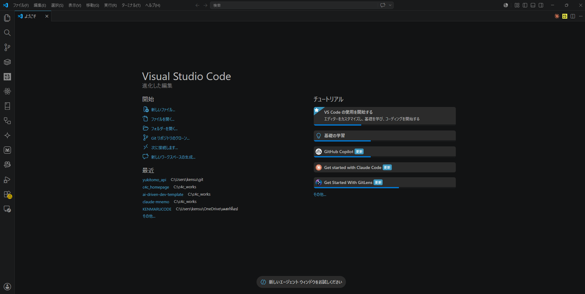</p>
<p><strong>確認ポイント：</strong> 左サイドバーにアイコンが縦に並んでいるか。 一番上が「エクスプローラー」、上から 4 番目が「拡張機能（四角が 4 つ並んだアイコン）」になっている。 ここを使って次のステップに進む。</p>
</div>

<div class="page-break"></div>

### 3.2 markdown-pdf 拡張機能をインストール

左サイドバーの **拡張機能アイコン**（四角が 4 つ並んだ形）をクリック。 ショートカットでも開ける。

| OS | ショートカット |
|:---|:---:|
| Windows | <kbd>Ctrl</kbd> + <kbd>Shift</kbd> + <kbd>X</kbd> |
| macOS | <kbd>Cmd</kbd> + <kbd>Shift</kbd> + <kbd>X</kbd> |

検索ボックスに `markdown-pdf` と入力。 一覧の一番上に表示される **yzane 製の Markdown PDF** を選び、緑色の `Install` ボタンを押す。

<div class="shape-box" data-title="STEP 02 — 拡張機能で markdown-pdf を検索">
<p></p>
<p><strong>選ぶのは yzane 製：</strong> 類似名の拡張がいくつかあるが、作者名 yzane のものが正解。 初回の PDF 出力時に Chromium（PDF 生成エンジン）が数百 MB ダウンロードされるので、ネット環境のいい場所でやるとスムーズ。</p>
</div>

<div class="page-break"></div>

### 3.3 settings.json を開く

VS Code の設定ファイル `settings.json` に、C4C ブランド用の設定を追記していく。 まずはコマンドパレットを開く。

| OS | ショートカット |
|:---|:---:|
| Windows | <kbd>Ctrl</kbd> + <kbd>Shift</kbd> + <kbd>P</kbd> |
| macOS | <kbd>Cmd</kbd> + <kbd>Shift</kbd> + <kbd>P</kbd> |

`Preferences: Open User Settings (JSON)` と入力して Enter。

<div class="shape-box" data-title="STEP 03 — コマンドパレットから settings.json を開く">
<p></p>
<p><strong>"(JSON)" 付きを選ぶ：</strong> 似た名前で「Open User Settings」もあるが、それを選ぶと GUI 画面が開いてしまう。 必ず末尾に <code>(JSON)</code> が付いている方を選ぶこと。</p>
</div>

<div class="page-break"></div>

`settings.json` の実体は OS によって場所が違うが、コマンドパレット経由で開けば自動でその場所が開かれる。

| OS | settings.json のパス |
|:---|:---|
| Windows | `%APPDATA%\Code\User\settings.json` |
| macOS | `~/Library/Application Support/Code/User/settings.json` |

### 3.4 settings.json に C4C 用設定を追記

開いた `settings.json` に、ZIP 同梱の `pdf-setup/settings.json.sample` の中身を追記する。 既存の設定を消さないよう注意。

<div class="callout callout-warning">
<p><strong>注意：</strong> JSON は <code>{</code> と <code>}</code> の中にカンマ区切りでキーを並べる形式。 末尾カンマ忘れ・ダブルクォートの全角化（"" でなく ""）でエラーになる。 VS Code が赤い波線で教えてくれるので、波線が消える状態を目指す。</p>
</div>

<div class="shape-box" data-title="STEP 04 — settings.json に設定を追記">
<p>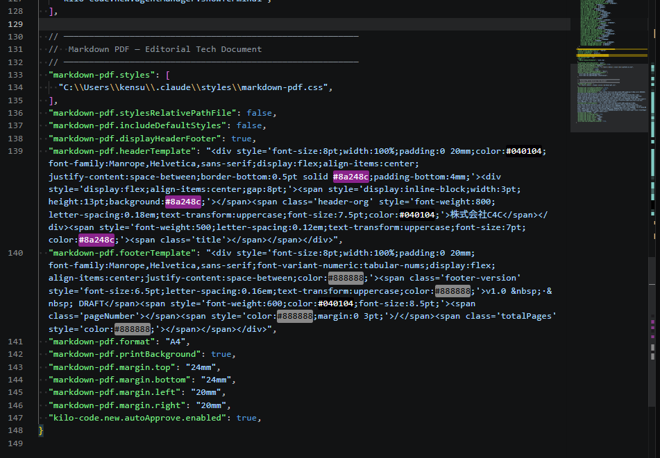</p>
<p><strong>追記するのは markdown-pdf 系のキー：</strong> <code>styles</code> / <code>headerTemplate</code> / <code>footerTemplate</code> / <code>format</code> / <code>printBackground</code> / <code>margin</code> など。 全文は ZIP 内の <code>settings.json.sample</code> をそのままコピペでよい。</p>
</div>

<div class="page-break"></div>

<div class="shape-box" data-title="STEP 05 — 追記する JSON コードの中身">
<p></p>
<p><strong>核心は styles のパス：</strong> <code>"markdown-pdf.styles"</code> で <code>markdown-pdf.css</code> の絶対パスを指定する。 Windows はバックスラッシュを <code>\\</code> と二重にする、macOS は <code>/</code> 区切りで絶対パスを書く。</p>
</div>

<div class="page-break"></div>

### 3.5 markdown-pdf.css を配置する

`settings.json` で指定したパスに、ZIP 同梱の `pdf-setup/markdown-pdf.css` を配置する。 推奨配置先は以下。

| OS | 推奨配置パス |
|:---|:---|
| Windows | `C:\c4c_works\markdown-c4c\markdown-pdf.css` |
| macOS | `~/c4c_works/markdown-c4c/markdown-pdf.css` |

エクスプローラー（Windows）または Finder（macOS）で上記フォルダを作成し、ZIP 内の `markdown-pdf.css` をコピーする。 `settings.json` 内の `"markdown-pdf.styles"` のパスがこの配置先と一致していれば OK。

```jsonc
// Windows（バックスラッシュは \\ と二重にする）
"markdown-pdf.styles": [
  "C:\\c4c_works\\markdown-c4c\\markdown-pdf.css"
]

// macOS（絶対パス、~ は使えないので絶対パスで書く）
"markdown-pdf.styles": [
  "/Users/yourname/c4c_works/markdown-c4c/markdown-pdf.css"
]
```

<div class="callout callout-tip">
<p><strong>TIP：</strong> Windows のパスで <code>\</code> を 1 本だけ書くと JSON エラーになる。 必ず <code>\\</code> と 2 本書く（JSON 仕様）。 macOS は <code>/</code> 1 本で OK。</p>
</div>

これで VS Code 側のセットアップは完了。 次は Claude Web 側でスキルを登録する。

<h2 id="sec-claude">4. Claude Web にスキルを登録</h2>

##### PHASE 2

Claude Web に **markdown-c4c スキル**を登録すると、「Markdown で書いて」と頼んだだけで C4C ブランドのフォーマットで出力されるようになる。

### 4.1 GitHub Release から ZIP をダウンロード

以下の GitHub Release ページにアクセスして、最新の `markdown-c4c-vX.Y.Z.zip` をダウンロードする。

<div class="shape-box shape-brand">
<p><strong>Release URL：</strong> <a href="https://github.com/SarojSeenuan/skill-markdown-c4c/releases">https://github.com/SarojSeenuan/skill-markdown-c4c/releases</a></p>
</div>

ページの一番上に表示される最新バージョンの `Assets` セクションを開き、`markdown-c4c-vX.Y.Z.zip`（X.Y.Z は最新の番号）をクリックするとダウンロードが始まる。

<div class="page-break"></div>

<div class="shape-box" data-title="STEP 06 — Release ページから ZIP をダウンロード">
<p>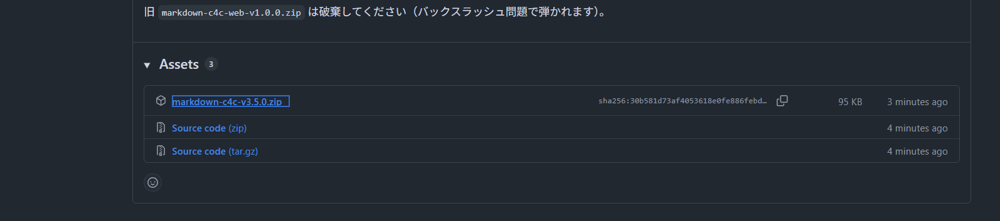</p>
<p><strong>常に最新版を取る：</strong> Release ページの一番上にある最新バージョン（例: <code>markdown-c4c-v5.1.0.zip</code>）を選ぶ。 古いバージョンには最新のコンポーネントが入っていない場合がある。 ダウンロードしたら <strong>解凍せずそのまま</strong>使う（Claude Web は ZIP のまま受け取る）。</p>
</div>

<div class="page-break"></div>

### 4.2 Claude Web のサイドバーを確認

ブラウザで [claude.ai](https://claude.ai/) にログイン。 画面左側にサイドバーが表示されていることを確認する。

<div class="shape-box" data-title="STEP 07 — Claude Web のサイドバーを確認">
<p>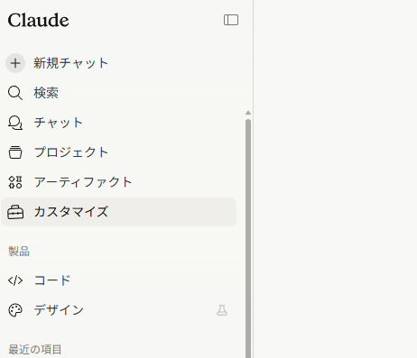</p>
<p><strong>確認ポイント：</strong> サイドバー左下に自分のアイコンが表示されていれば、無料アカウントでもスキル登録機能が使える状態。 もしサイドバーが折りたたまれていたら、画面左上のメニューボタンで展開する。</p>
</div>

<div class="page-break"></div>

### 4.3 カスタマイズメニューからスキルタブへ

サイドバーのアイコンから「カスタマイズ」メニューを開き、スキルタブにアクセスする。

<div class="shape-box" data-title="STEP 08 — カスタマイズメニューを開く">
<p>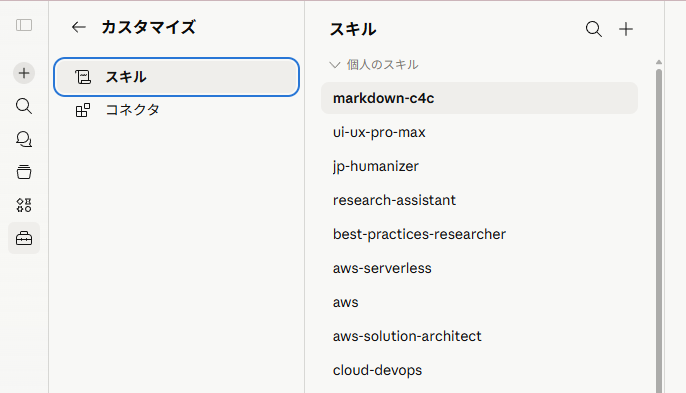</p>
<p><strong>場所が分かりにくい場合：</strong> Claude Web は UI を頻繁に更新する。 「カスタマイズ」「Customize」「設定」「Skills」「スキル」のいずれかのキーワードを探す。 大抵はアカウントアイコンか、左下のメニュー配下にある。</p>
</div>

<div class="page-break"></div>

### 4.4 スキルをアップロード（1/2）

スキルタブで「アップロード」「Upload skill」などのボタンをクリック。 ファイル選択ダイアログが開いたら、先ほどダウンロードした `markdown-c4c-vX.Y.Z.zip` を選ぶ。

<div class="shape-box" data-title="STEP 09 — スキルアップロード画面を開く">
<p>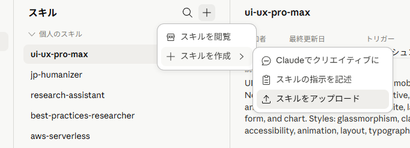</p>
<p><strong>ZIP を選ぶだけ：</strong> 解凍する必要はなし。 ZIP のままドラッグ＆ドロップで OK のケースもある。 ファイル選択ダイアログから選んでもよい。</p>
</div>

<div class="page-break"></div>

### 4.5 スキルをアップロード（2/2）

ZIP を選ぶとアップロードが始まる。 数秒で完了する。

<div class="shape-box" data-title="STEP 10 — スキルアップロード完了">
<p>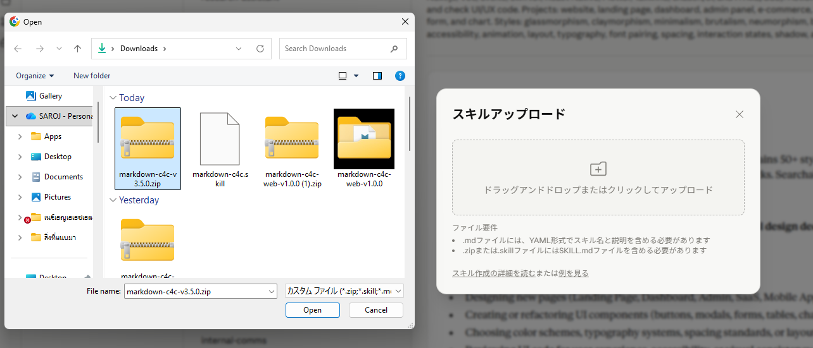</p>
<p><strong>アップロード後の表示：</strong> スキル一覧に <code>markdown-c4c</code> が追加されていれば成功。 説明文・バージョン・トリガー条件が表示される。</p>
</div>

<div class="page-break"></div>

### 4.6 スキルが登録されたことを確認

一覧画面で `markdown-c4c` が「有効」になっていることを確認する。

<div class="shape-box" data-title="STEP 11 — スキル登録完了の確認">
<p>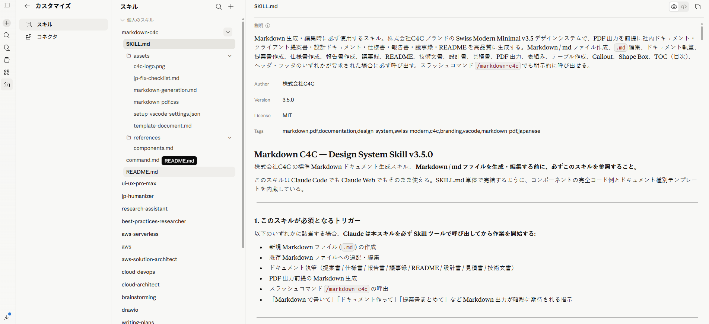</p>
<p><strong>確認ポイント：</strong> スキル名・バージョン・説明が一覧に出ていれば登録成功。 トグルスイッチが「有効」側になっていることも確認する。 ここでオフになっていると、依頼してもスキルが発動しない。</p>
</div>

<div class="page-break"></div>

### 4.7 日本語出力チェックも同梱されている

`markdown-c4c` には日本語の AI 臭を取る **JP Fix チェックリスト**（8 項目）が同梱されている。 提案書・報告書を日本語で書くときの品質を担保する仕組み。

<div class="shape-box" data-title="STEP 12 — JP Fix も同梱されている">
<p>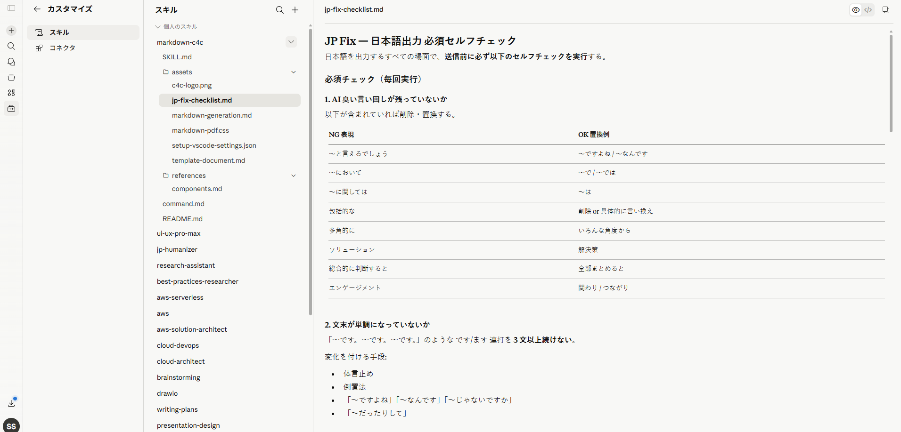</p>
<p><strong>JP Fix 8 項目：</strong> AI 臭表現・です/ます連打・主語過剰・接続詞連鎖・漢字比率 30〜40%・抽象動詞連打・モード選択・句読点ルール。 Markdown 生成後にこれらを自動チェックして自然な日本語に整える。</p>
</div>

<h2 id="sec-use">5. Claude Web でスキルを使ってみる</h2>

##### PHASE 3

セットアップが終わったので、実際にスキルを呼び出して Markdown を生成してみる。

### 5.1 スラッシュコマンドでスキル呼出テスト

Claude Web の入力欄で `/markdown-c4c` と入力するか、もしくは「○○の提案書を markdown-c4c で書いて」と直接お願いする。 スキルが起動すると、AI が事前に必要な情報を質問してくる（Q&A ワークフロー）。

<div class="page-break"></div>

<div class="shape-box" data-title="STEP 13 — スラッシュコマンドで呼出テスト">
<p>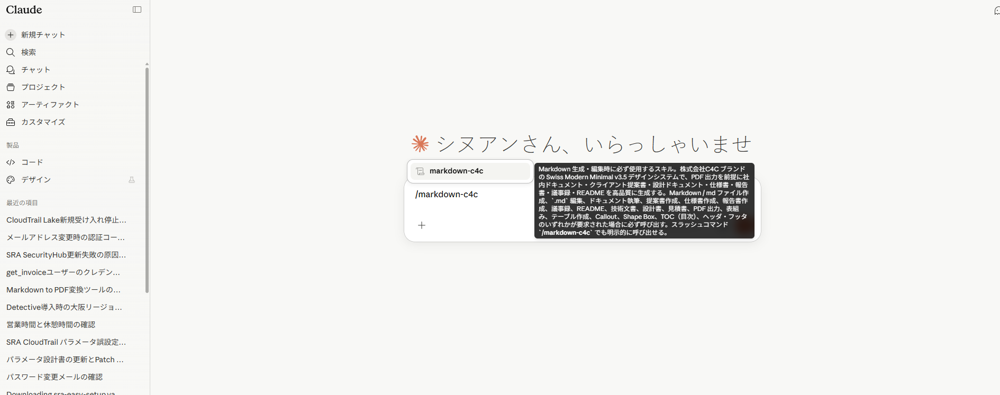</p>
<p><strong>2 通りの呼び方：</strong> <code>/markdown-c4c</code> でメニューから選ぶか、自然文で「Markdown で書いて」「提案書まとめて」と頼むか。 どちらでもスキルが自動起動する。 スキルが正しく登録されていれば、画面に「Skill: markdown-c4c」のような表示が出る。</p>
</div>

<div class="page-break"></div>

### 5.2 プロンプトを入力

スキルが起動したら、書きたい内容を伝える。 例: 「AWS 移行プロジェクトの提案書を、クライアント A 社向けに書いて」「3 月度の事業報告書を作って」「議事録を作りたい」など、自由文で OK。

<div class="shape-box" data-title="STEP 14 — プロンプト入力">
<p>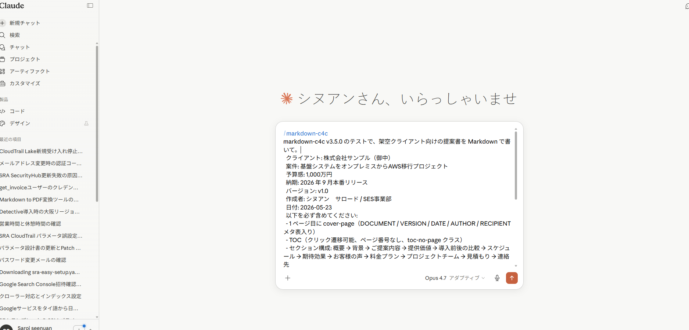</p>
<p><strong>Q&A に答えるだけで完成：</strong> スキルは「ドキュメント種別は？」「読者は？」「主要メッセージは？」など 5 項目以上の質問をしてくる。 これに答えるだけで、構成・コンポーネント・章立てまでが自動で決まる。</p>
</div>

<div class="page-break"></div>

### 5.3 スキルが実行されたことを確認

Q&A 完了後、AI が Markdown を生成し始める。 ヘッダに「Using markdown-c4c」のような表示が出れば、スキルが正しく動いている。

<div class="shape-box" data-title="STEP 15 — スキル実行中">
<p>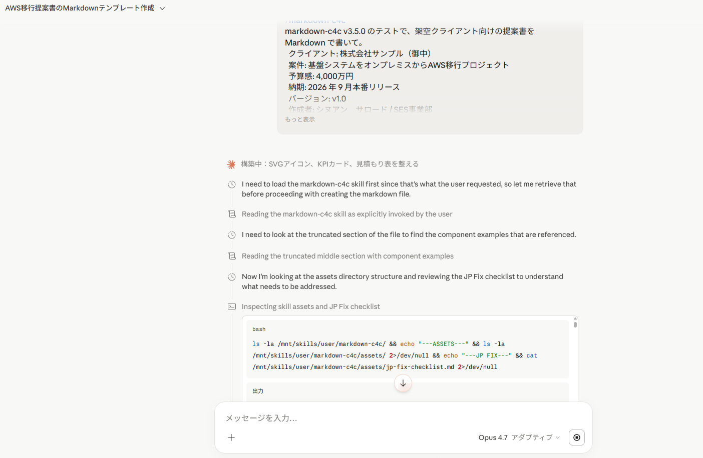</p>
<p><strong>確認ポイント：</strong> 表示に「markdown-c4c」「Skill」「v5.1」などの記載があれば、ブランドフォーマットで生成中。 もし普通の Markdown（H1 # ばかりが並ぶ素っ気ない形）になっていたら、スキルが起動していない可能性が高い。 もう一度スラッシュコマンドで明示的に呼び出す。</p>
</div>

<div class="page-break"></div>

### 5.4 Markdown ファイルが出力されたことを確認

生成完了すると、チャット内に Markdown のフルテキストが出る。 `cover-page` で始まり `closing-page` で終わる構造になっていれば、ブランドフォーマットが正しく適用されている。

<div class="shape-box" data-title="STEP 16 — Markdown が生成された">
<p>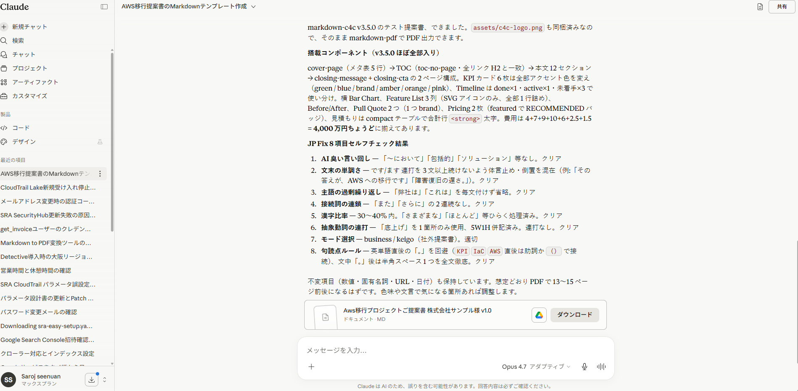</p>
<p><strong>確認ポイント：</strong> 冒頭に <code>&lt;div class="cover-page"&gt;</code> の表紙ブロック、TOC（目次）、複数の H2 セクション、末尾に <code>&lt;div class="closing-page"&gt;</code> の締めページがあれば成功。 これをコピーして手元の <code>.md</code> ファイルに保存すれば、次のフェーズで PDF 化できる。</p>
</div>

<h2 id="sec-logo">6. C4C ロゴ画像の配置（任意）</h2>

##### OPTIONAL

生成された Markdown に **C4C ロゴ画像**（`assets/c4c-logo.png`）への参照が含まれている場合は、PDF 化の前にロゴ画像を所定の位置に置く必要がある。 ロゴを使わないシンプルな文書の場合はこのセクションを飛ばしてよい。

### 6.1 Markdown ファイルを保存する場所を決める

生成された Markdown をテキストエディタや VS Code にコピー → 任意の場所に `.md` として保存する。 ファイル名は `種別-内容-バージョン.md` の形式が読みやすい（例: `proposal-aws-migration-v1.0.md`）。

| OS | 推奨格納先（例） |
|:---|:---|
| Windows | `C:\Users\<ユーザー名>\Documents\c4c-docs\<案件名>\`<br>または `C:\c4c_works\<案件名>\docs\` |
| macOS | `~/Documents/c4c-docs/<案件名>/`<br>または `~/Projects/<案件名>/docs/` |

### 6.2 同じ階層に assets/ フォルダを作る

Markdown ファイルと **同じ階層**に `assets/` というフォルダを新規作成する。 Markdown 内では `assets/c4c-logo.png` という相対パスでロゴを参照しているため、この位置にないと PDF 化時に画像が見つからずエラーになる。

### 6.3 ZIP 内のロゴ画像をコピーする

ダウンロードした `markdown-c4c-vX.Y.Z.zip` を解凍し、中の `assets/c4c-logo.png` を、先ほど作った `assets/` フォルダにコピーする。

```powershell
# Windows PowerShell の例
Copy-Item "C:\Downloads\markdown-c4c-v5.1.0\assets\c4c-logo.png" `
          "C:\c4c_works\proposal-aws\assets\c4c-logo.png"
```

```bash
# macOS bash の例
mkdir -p ~/Projects/proposal-aws/assets
cp ~/Downloads/markdown-c4c-v5.1.0/assets/c4c-logo.png \
   ~/Projects/proposal-aws/assets/
```

<div class="callout callout-info">
<p><strong>INFO：</strong> ロゴ画像は表紙や締めページの <code>closing-watermark</code> パターンで使われる。 Markdown 内の <code>&lt;img src="assets/c4c-logo.png"&gt;</code> がそのまま機能するよう、パスを変えずに同じ階層に配置するのがポイント。</p>
</div>

<h2 id="sec-pdf">7. VS Code で PDF 化</h2>

##### PHASE 4

Markdown ファイルを VS Code で開き、右クリックメニューから PDF にエクスポートする。

### 7.1 Markdown を開いて右クリック

保存した `.md` ファイルを VS Code で開き、エディタの本文上で **右クリック** → `Markdown PDF: Export (pdf)` を選択。

<div class="page-break"></div>

<div class="shape-box" data-title="STEP 17 — 右クリックから Export (pdf)">
<p>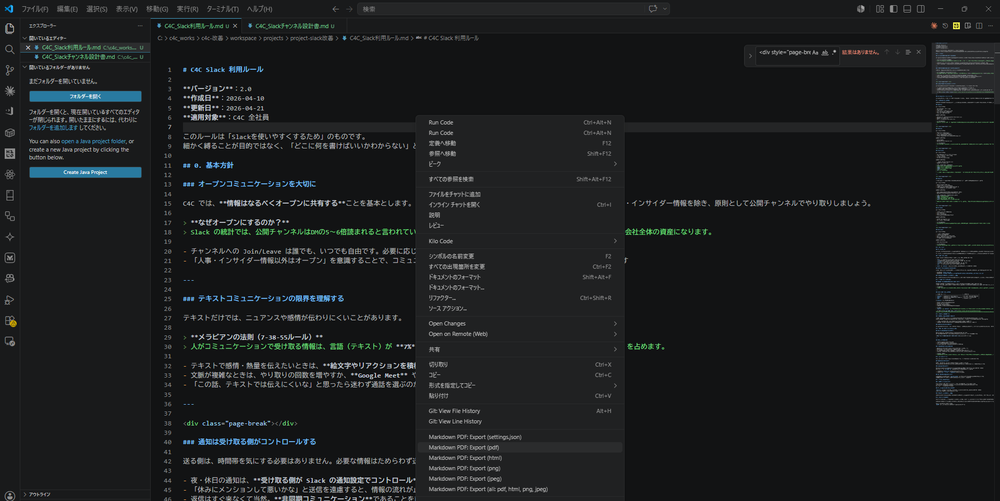</p>
<p><strong>4 つの Export がある：</strong> <code>pdf</code> / <code>html</code> / <code>png</code> / <code>jpeg</code> が並ぶが、ブランドフォーマットは PDF 用に最適化されているので <code>pdf</code> を選ぶ。 他の形式は CSS が完全には反映されない。</p>
</div>

<div class="page-break"></div>

### 7.2 PDF 出力中

エクスポートを開始すると、VS Code 下部のステータスバーに進捗が表示される。 初回は Chromium のダウンロードが入るので数十秒〜数分かかる。 2 回目以降は数秒で完了する。

<div class="shape-box" data-title="STEP 18 — VS Code で PDF 出力中">
<p>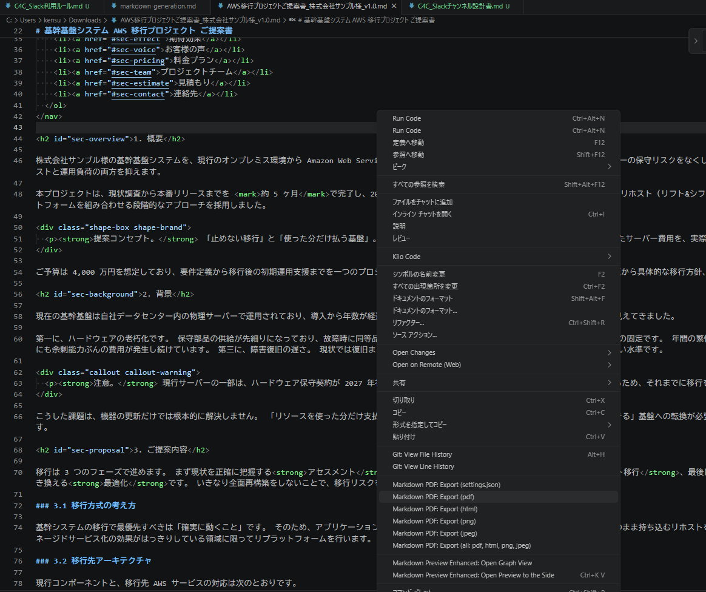</p>
<p><strong>初回は時間がかかる：</strong> 内部で Chromium（PDF レンダリングエンジン）が数百 MB ダウンロードされる。 一度終われば次回以降は数秒で出力できる。 進捗が止まって見えるときも、ネット接続が生きていればそのまま待つ。</p>
</div>

<div class="page-break"></div>

### 7.3 PDF の出力先を確認

PDF は **Markdown ファイルと同じフォルダ**に `<元ファイル名>.pdf` として自動保存される。 別ウィンドウやダイアログで保存先を聞かれることはない。 たとえば `C:\c4c_works\skill-markdown-c4c\SETUP-WEB.md` から出力した場合、同じフォルダに `SETUP-WEB.pdf` が並ぶ。

<div class="page-break"></div>

<div class="shape-box" data-title="STEP 19 — PDF は MD と同じフォルダに出る">
<p>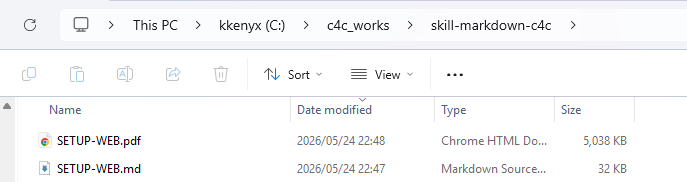</p>
<p><strong>確認ポイント：</strong> エクスポート完了後にエクスプローラー（Finder）で MD ファイルのあるフォルダを開くと、同じ名前で拡張子だけ <code>.pdf</code> に変わったファイルが並ぶ。 上の例では <code>SETUP-WEB.md</code>（32 KB）と <code>SETUP-WEB.pdf</code>（5,038 KB）が同じフォルダに保存されている。 PDF のほうがサイズが大きいのは、画像とフォントが埋め込まれているため。</p>
</div>

<div class="page-break"></div>

##### FILE PATH

ファイルパスと画像表示の関係を理解しておくと、画像が出ない・PDF が壊れるトラブルを未然に防げる。

Markdown 内で画像を参照するときは、`` や `` のように **相対パス**で書く。 この相対パスは、MD ファイルそのものの位置を基準に解釈される。

```
C:\c4c_works\skill-markdown-c4c\        ← この階層が基準
├── SETUP-WEB.md                        ← 
└── assets\                             ← MD と同じ階層に置く
    ├── c4c-logo.png                    ← closing-watermark 用
    └── setup-web\
        ├── 01-vscode-launch.png        ← 解決される相対パス
        └── ...
```

画像が PDF に表示されるための条件は 3 つ。

- [ ] MD ファイルと `assets/` フォルダが **同じ階層**にある
- [ ] MD 内で書いた相対パス（`assets/xxx.png`）と、実際のファイル配置が **完全一致**している
- [ ] ファイル名の **大文字小文字も一致**している（macOS / Linux は厳密に区別される）

<div class="callout callout-warning">
<p><strong>注意：</strong> MD ファイルを別の場所にコピーして PDF 化すると、相対パスが壊れて画像が表示されない PDF が出る。 移動するときは <code>assets/</code> フォルダごとコピーすること。</p>
</div>

<div class="callout callout-info">
<p><strong>INFO：</strong> 絶対パス（<code>C:\...</code> や <code>/Users/...</code>）で画像を参照することもできるが、PC を移動したり別の人に渡したりすると壊れるため非推奨。 相対パス + <code>assets/</code> フォルダ同梱が標準。</p>
</div>

### 7.4 PDF を確認（表紙から最終ページまで）

出力された PDF を開いて、表紙から順に仕上がりを確認する。 ここから 8 ページにわたって、見るべきポイントを 1 つずつ示す。

<div class="shape-box" data-title="STEP 20 — PDF 確認 1/8 表紙">
<p>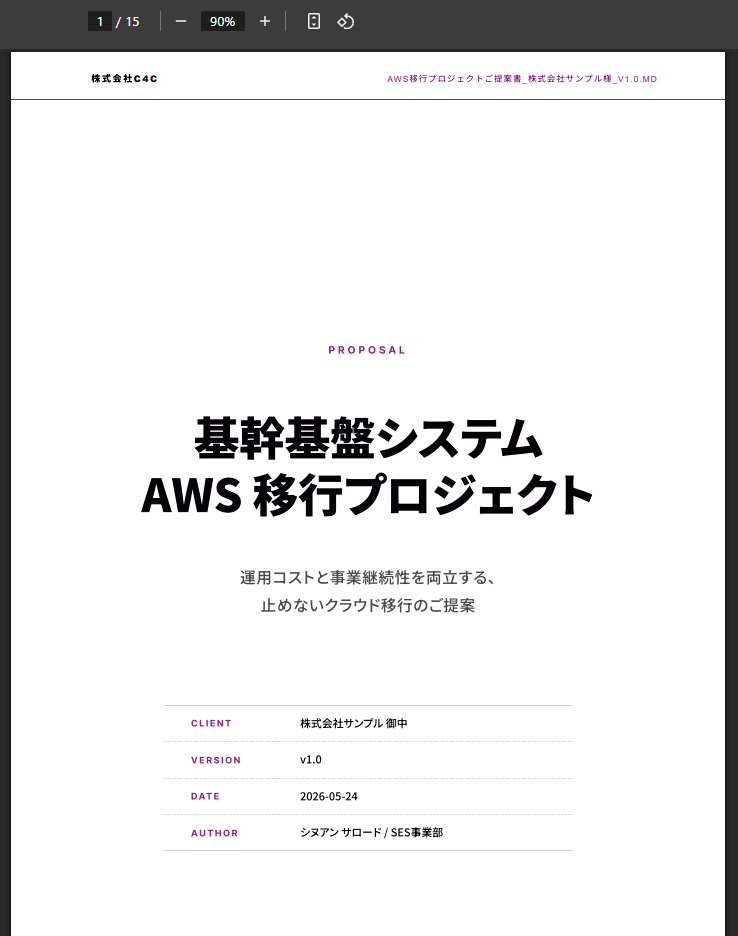</p>
<p><strong>ここを見る：</strong> 表紙の eyebrow（PROPOSAL / SPECIFICATION など）、タイトル、サブタイトル、メタ情報（CLIENT / VERSION / DATE / AUTHOR）がブランドカラーで整然と並んでいるか。</p>
</div>

<div class="page-break"></div>

<div class="shape-box" data-title="STEP 21 — PDF 確認 2/8 本文セクション">
<p>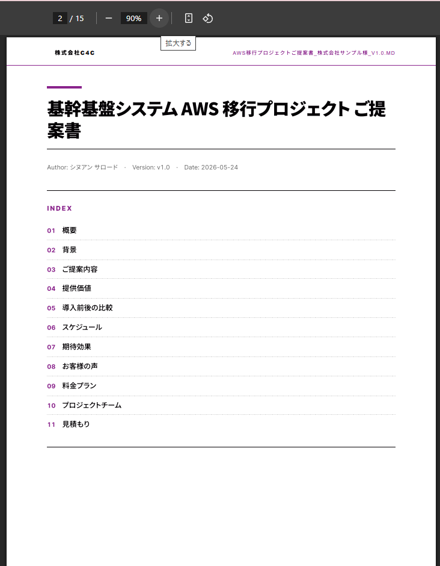</p>
<p><strong>ここを見る：</strong> H2 セクションが新しいページから始まっているか。 マゼンタの罫線、タイポグラフィ（Inter Tight / Manrope）、段落の余白がきれいに揃っているか。</p>
</div>

<div class="page-break"></div>

<div class="shape-box" data-title="STEP 22 — PDF 確認 3/8 Callout">
<p>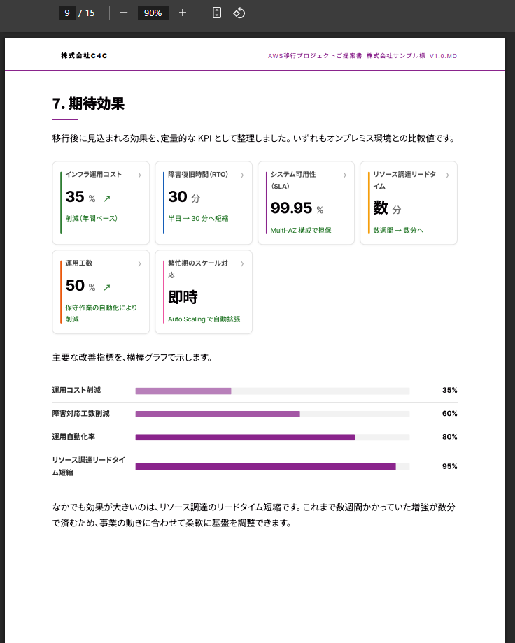</p>
<p><strong>ここを見る：</strong> Callout の 5 色（青 NOTE / 緑 TIP / 水色 INFO / 橙 注意 / 赤 重要）が見分けやすく出ているか。 左端のアクセントバーが効いているか。</p>
</div>

<div class="page-break"></div>

<div class="shape-box" data-title="STEP 23 — PDF 確認 4/8 Shape Box">
<p>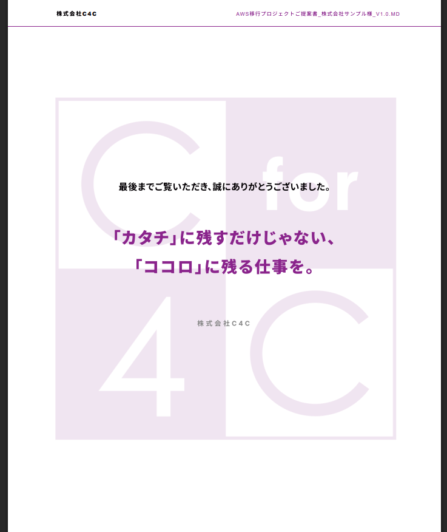</p>
<p><strong>ここを見る：</strong> Shape Box（標準 / 塗り背景 / 太枠 / ブランド色 / タイトル付き）が用途別に使い分けられているか。 タイトル付きの <code>data-title</code> ラベルがマゼンタで表示されているか。</p>
</div>

<div class="page-break"></div>

<div class="shape-box" data-title="STEP 24 — PDF 確認 5/8 テーブル">
<p>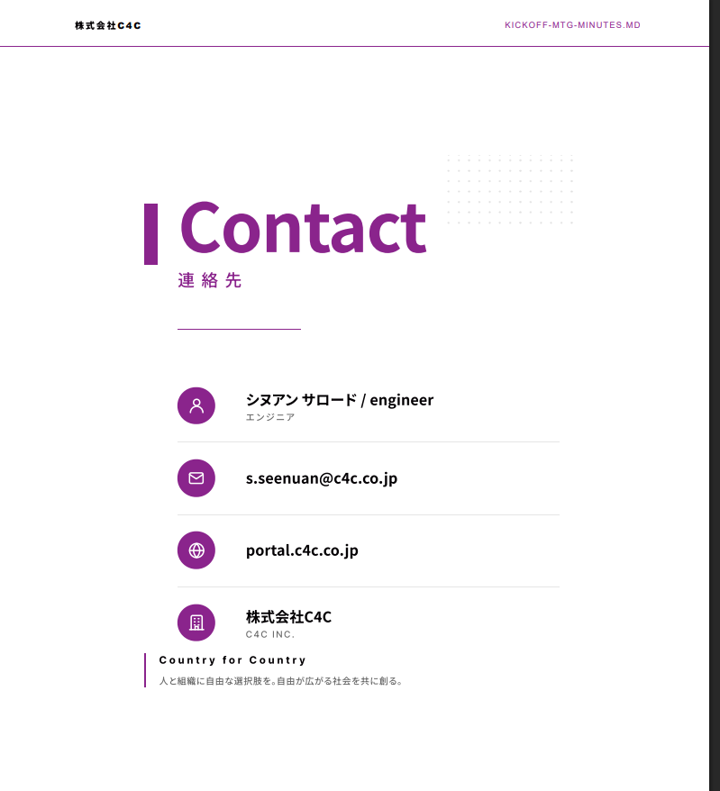</p>
<p><strong>ここを見る：</strong> テーブルのヘッダがブランド色で塗られ、行間・セルの余白が均等か。 アラインメント指定（左寄せ / 中央 / 右寄せ）が効いているか。</p>
</div>

<div class="page-break"></div>

<div class="shape-box" data-title="STEP 25 — PDF 確認 6/8 コードブロック">
<p>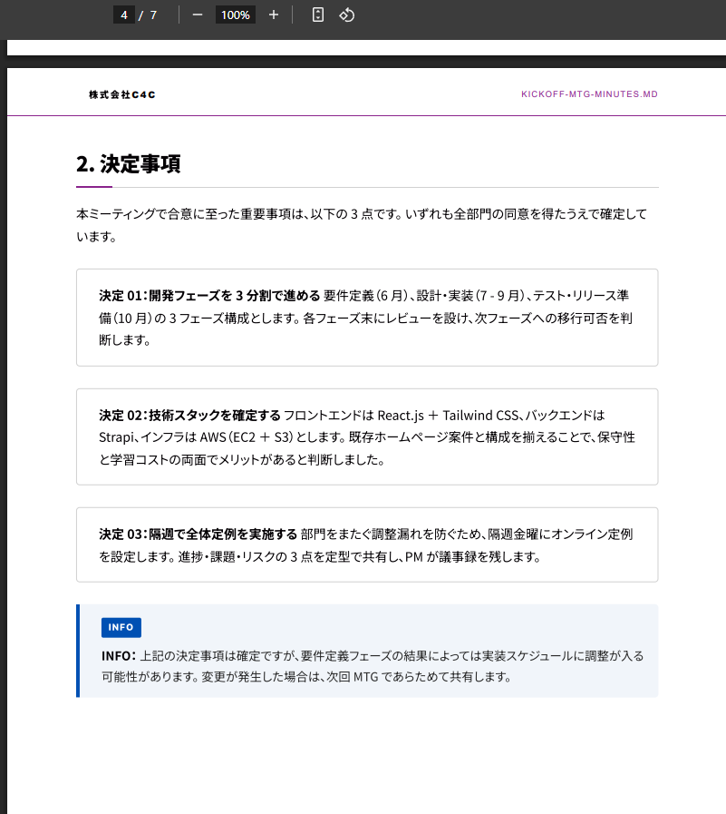</p>
<p><strong>ここを見る：</strong> コードブロックが One Dark Pro 配色でシンタックスハイライトされているか。 <code>data-filename</code> 付きの場合はファイル名タブが上部に出ているか。</p>
</div>

<div class="page-break"></div>

<div class="shape-box" data-title="STEP 26 — PDF 確認 7/8 締めページ">
<p>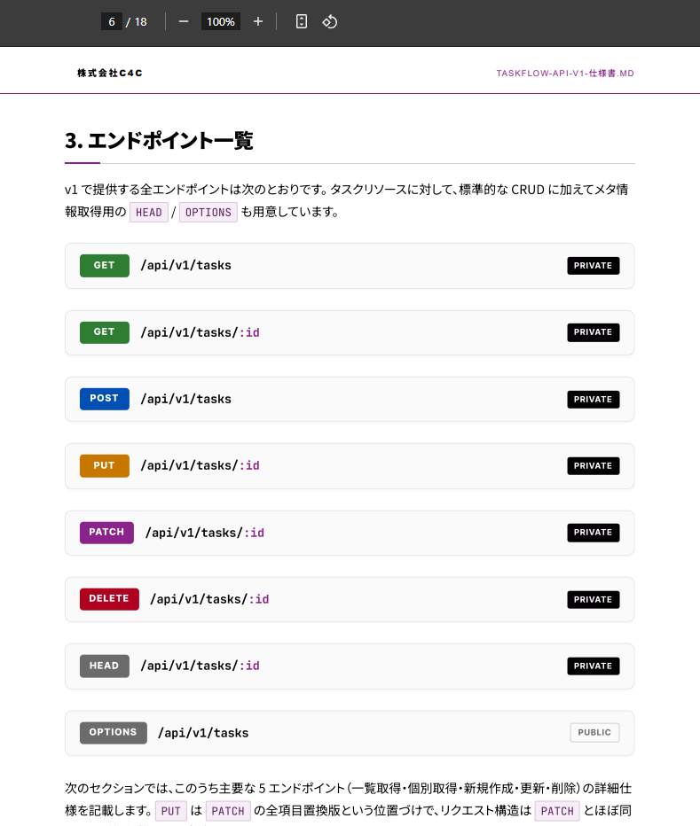</p>
<p><strong>ここを見る：</strong> 締めページ（closing-message / closing-watermark / closing-cta / closing-contact のいずれか）が、余白とタイポグラフィだけで意味を持たせる構成になっているか。 罫線や装飾が出ていないか（v5.0 以降は cover/closing 内に hr を書かない方針）。</p>
</div>

<div class="page-break"></div>

<div class="shape-box" data-title="STEP 27 — PDF 確認 8/8 ヘッダ・フッタ">
<p>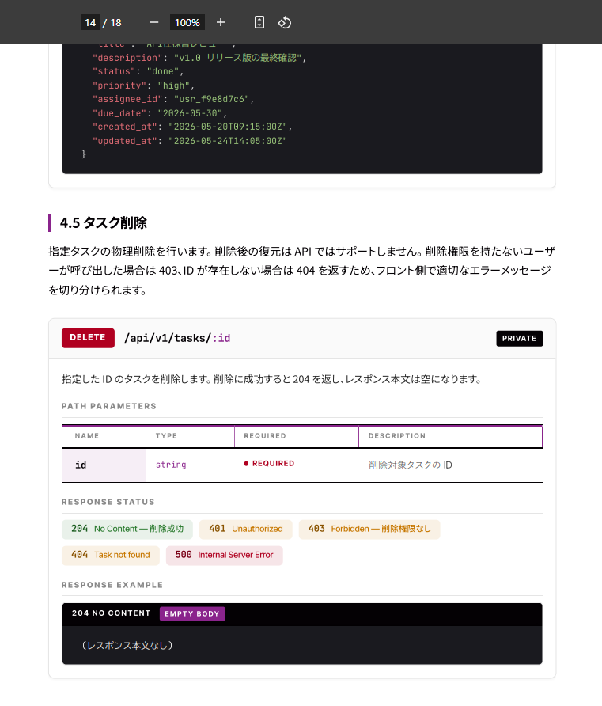</p>
<p><strong>ここを見る：</strong> ヘッダ左に「株式会社C4C」、ヘッダ右にドキュメントタイトル、ヘッダ下にマゼンタの罫線。 フッタ右にページ番号（現在 / 総数）、フッタ左は空。 ここまで揃っていれば完璧な仕上がり。</p>
</div>

<div class="page-break"></div>

##### FINAL CHECKLIST

PDF 確認時の総合チェックリスト。

- [ ] 1 ページ目に表紙（cover-page）が出ている
- [ ] ヘッダ左に「株式会社C4C」が縦バー付きで表示されている
- [ ] ヘッダ下にマゼンタ色（`#8A248C`）の罫線がある
- [ ] フッタ左は空、フッタ右にページ番号
- [ ] Callout の 5 色が出ている
- [ ] H2 セクションごとに改ページしている
- [ ] フォントが Inter Tight / Manrope / 和文ゴシックで読める
- [ ] 画像（ロゴ・図表）がすべて表示されている
- [ ] 締めページが表紙と同じ品質で出ている

すべて OK なら導入完了。 これで Claude Web 生成 → VS Code で PDF 化、の日常運用ができる状態。

<h2 id="sec-trouble">8. トラブルシュート</h2>

##### TROUBLESHOOTING

導入時に詰まりやすい代表的な症状と対処法。

| 症状 | 原因 | 対処 |
|:---|:---|:---|
| CSS が反映されない（白黒の素っ気ない PDF） | `markdown-pdf.styles` のパスが間違っている | settings.json を再確認。 Windows は `\\` の二重バックスラッシュ、macOS は絶対パスで `/` |
| 初回 PDF 出力で 1 分以上待たされる | Chromium の初回ダウンロード | そのまま待つ。 2 回目以降は数秒で終わる |
| 「ファイルが見つかりません」エラー | CSS ファイルが配置されていない | 配置先パスに `markdown-pdf.css` が存在するか確認 |
| ヘッダ・フッタが出ない | `displayHeaderFooter` が `false` | settings.json で `true` に変更 |
| 日本語が文字化け（Windows） | フォントが読み込めていない | Windows は游ゴシックが自動フォールバック。 Yu Gothic がない場合は MS Gothic で代替表示 |
| 日本語が文字化け（macOS） | フォントが読み込めていない | macOS は Hiragino 系がデフォルトで入っているので通常問題なし。 出ない場合は `~/Library/Fonts/` を確認 |
| ロゴ画像が表示されない | `assets/c4c-logo.png` が配置されていない | Markdown と同じ階層に `assets/` フォルダを作り、ZIP 内のロゴを配置（セクション 6 参照） |
| Claude Web でスキルが起動しない | スキルが「無効」になっている / アップロードに失敗 | カスタマイズ → スキルタブで `markdown-c4c` のトグルが ON か確認。 OFF なら ON に切り替え |
| スキル起動はするが普通の Markdown が出る | 旧バージョンが残っている | 最新の ZIP を再アップロード。 古いバージョンは削除する |
| 改ページがおかしい | H2 以外で改ページしている | H1 ではなく H2 で各セクションを始めているか確認 |
| TOC のページ番号が実際とズレる | TOC に `<span class="page">` を書いている | `toc-no-page` クラスを必ず付けて、ページ番号は記載しない |

<div class="callout callout-tip">
<p><strong>TIP：</strong> どうしても解決しない場合は、settings.json の中身と PDF 出力時のエラーメッセージを保存して、株式会社C4C のシヌアン サロードに連絡してください。</p>
</div>

<div class="closing-page closing-watermark">
  
  <p class="closing-thanks">最後までご覧いただき、誠にありがとうございました。</p>
  <p class="closing-credo">「カタチ」に残すだけじゃない、<br>「ココロ」に残る仕事を。</p>
  <p class="closing-org">株式会社C4C</p>
</div>
