<head>
<title>Markdownから作成されたPDF資料を強化させてみた</title>
</head>

<div class="cover-page">
  <div class="cover-body">
    <span class="cover-eyebrow">ARTICLE</span>
    <h1 class="cover-title">Markdownから作成された<br>PDF資料を強化させてみた</h1>
    <p class="cover-subtitle">v3.0 から v5.1 までの進化を 1 本の記事にまとめた、
markdown-c4c 開発記録。</p>
  </div>
  <table class="cover-meta">
    <tr><th>AUTHOR</th><td>Saroj Seenuan (Ken)</td></tr>
    <tr><th>VERSION</th><td>v5.1.0（記事 v1.1）</td></tr>
    <tr><th>DATE</th><td>2026-05-24</td></tr>
    <tr><th>ORG</th><td>株式会社C4C</td></tr>
  </table>
</div>

<div class="no-break">

# Markdownから作成された<br>PDF資料を強化させてみた

<div class="caption">Author: Saroj Seenuan (Ken)　·　Version: v5.1.0 · ARTICLE　·　Date: 2026-05-24　·　株式会社C4C</div>

<div class="shape-box shape-brand">
<p><strong>この記事の要約</strong>　·　AI 時代になって Markdown で書く資料が一気に増えたんですが、PDF にすると地味で読みにくい。それで <span class="brand">markdown-c4c</span> という社内専用デザインテンプレートを作って、Markdown のコードは <mark>一行も変えずに</mark> PDF だけが化けるようにしてみました。</p>
</div>

<nav class="toc toc-no-page">
  <h2>Index</h2>
  <ol>
    <li><a href="#sec-1">きっかけ — AI時代の「Markdownあるある」</a></li>
    <li><a href="#sec-2">じゃあ、見た目をカスタマイズしてみよう</a></li>
    <li><a href="#sec-3">作ったもの — markdown-c4c v3.0</a></li>
    <li><a href="#sec-4">Before / After — コードを変えずに PDF だけが化ける</a></li>
    <li><a href="#sec-5">セットアップ — 5 分で導入</a></li>
    <li><a href="#sec-6">使い方 — 書く側は何も変わらない</a></li>
    <li><a href="#sec-7">社内展開と今後</a></li>
    <li><a href="#sec-8">v5.1.0 までの進化（追記）</a></li>
  </ol>
</nav>

</div>

<h2 id="sec-1">1. きっかけ — AI時代の「Markdownあるある」</h2>

##### INTRO

ある日、Slack で同僚からメッセージが届きました。

<div class="shape-box shape-outline">
<p>「これ Markdown でまとめといたから、目通しといて〜」</p>
</div>

開いてみたら、**AI が書いた 1500 行の `.md` ファイル**。スクロールバーが米粒みたいになるやつ。
「まあ Markdown なら拡張機能で PDF にすればいいか」とサクッと変換して開いたら…。

<div class="callout callout-danger">
<p><strong>出てきた PDF が、ダサくて、読みづらい。</strong>結局誰も読まない。最初の 1 ページで「あ、無理」となって閉じられる。AI ががんばって書いた 1500 行が、誰の目にも触れずに消えていく。</p>
</div>

思い当たる人、めちゃくちゃ多いんじゃないでしょうか。

ここから始まる話は、大きく 3 つに分かれます。**まず「AI が書いた Markdown を読む人が詰む」問題、次に「じゃあ最終形式で書かせれば？」というよくある反論、最後に「社内のドキュメント乱立」という別の問題**。順番に見ていきます。

<hr class="divider-dot-line">

### 1-A. AI が書いた Markdown、誰も読まない

そもそも Markdown って、書く側には最高なんですよ。AI が秒で出してくれるし、Git で差分も追えるし、テキストだから検索もラク。テーブルもコードもチェックリストも、ぜんぶプレーンテキストで書ける。**生成効率だけで言ったら最強**です。

ところが、**読む側に回った瞬間、急に話が変わる**んですよね。

<div class="shape-box shape-filled">
<p><strong>Markdown を「読む側」に回ったときに起きること</strong></p>
<ul>
<li><strong>VS Code のプレビューで開く</strong> → 白背景に Times New Roman 風フォント、見出しの強弱がぼんやり、目が滑る</li>
<li><strong>拡張機能で PDF にする</strong> → 余白ゼロのびっしりレイアウト、ヘッダもフッタもなくてどこのページか分からん</li>
<li><strong>クライアントに送る</strong> → 「これ…正式な資料ですか？」って空気になる</li>
<li><strong>結局 Word や PowerPoint に貼り直す</strong> → AI に書かせた意味が消える 😭</li>
</ul>
</div>

実例をご覧ください。普通の Markdown を、デフォルト設定のまま PDF にしたやつです。

<figure>
  
  <figcaption>FIGURE 1.　デフォルト設定で出力した PDF（議事録系の例）。情報はあるけど「資料」としての佇まいがない</figcaption>
</figure>

しかも厄介なのは、**AI 自身がこの問題に 1 ミリも気付かない**ところ。AI は何行 Markdown を放り込まれても平気で読みます。1500 行だろうが 5000 行だろうが、構造化されたテキストなら問題なく処理できる。だから「**人間が読むときに見た目で詰む**」というシグナルは、AI 側に絶対に届かないんですよね。

<div class="callout callout-warning">
<p><strong>AI の盲点。</strong>「人間が PDF にして読んだときに、フォントとレイアウトが残念で読む気が失せた」という体感は、AI 側に返らない。だから永遠に、<mark>機械的には正しいけど人間が読みたくない Markdown</mark> が量産されつづける。</p>
</div>

AI に資料を書かせる時代になって、生成は超ラクになった。でも人間が読む段階で詰む。ここを埋めない限り、**せっかく 30 秒で出してくれた 1500 行が、出口の見た目で全部台無しになる**。

<hr class="divider-dot-brand">

### 1-B. 「じゃあ AI に Word / Docs で直接書かせれば？」 — それも詰む

ここまで読むと、こう思う人がいるはずです。

<div class="shape-box shape-outline">
<p>「だったら最初から Markdown じゃなくて、AI に <strong>Word や Google Docs、HTML で直接書かせれば</strong>いいんじゃない？」</p>
</div>

その発想、めちゃくちゃ自然です。実際それで解決する場面もある。**ただし、実務で回してみると、これがけっこう詰みやすい**んですよね。

<div class="shape-box shape-filled">
<p><strong>「AI に直接 Word / Docs / HTML で出させる」アプローチの落とし穴</strong></p>
<ul>
<li><strong>トークンが Markdown の数倍〜十数倍かかる</strong> — Word の <code>.docx</code> XML や HTML タグは記述がリッチな分、同じ内容でもコンテキストを大量に消費する。長文資料だと途中で打ち切られたり、編集ターンが回らなくなる</li>
<li><strong>差分管理がほぼ不可能</strong> — Git で <code>.docx</code> や複雑な HTML を diff しても人間には読めない。「どこを直したか」が見えなくなる</li>
<li><strong>AI 自身が編集しづらい</strong> — 自分が出した HTML の階層をさかのぼって一部だけ書き換えるのが、Markdown よりはっきり苦手。タグの開閉ミスで構造が壊れがち</li>
<li><strong>Google Docs API / Word マクロを叩く必要が出る</strong> — ローカルファイルとして手元に置いて Git 管理する世界観と相性が悪い</li>
<li><strong>結局スタイル指定で揉める</strong> — 「フォントは Inter で、見出しは…」を毎回プロンプトで指示するか、テンプレートを読み込ませる必要があって、結局「スタイル定義をどこかに置く」問題は消えない</li>
</ul>
</div>

つまり、**「最終形式そのもので生成させる」のは一見ラクに見えて、編集サイクルが破綻する**んです。Markdown が優秀すぎるんですよね、**人間にも AI にも編集しやすい中間形式**として。トークン効率も最高。

<div class="callout callout-tip">
<p><strong>このセクションの結論。</strong>Markdown を「中間言語」と割り切る。AI も人間も Markdown で書く・直す。<mark>最終出力の PDF / Word / HTML は、Markdown から自動変換するレイヤーで吸収する</mark>。これで編集サイクルのコストはそのまま、出口だけ複数フォーマットに広げられます。</p>
</div>

問題は、**Markdown のままだと PDF にしたときの見た目が残念**なこと。さっき見たやつです。ここを解決しない限り、結局 Word や PPT に貼り直す未来が待っている。

<hr class="divider-dot-line">

### 1-C. もうひとつの問題 — 社内のドキュメント、てんでバラバラ

ここまでは「AI に資料を書かせるときの出口問題」の話。次は **完全に別軸の話**で、社内の現場で起きていることです。

提案書を作るとき、誰かは Word を立ち上げて、誰かは PowerPoint で 1 ページずつ作り込み、また別の人は Google Docs で書いて PDF にエクスポートする。**同じ会社が出す資料なのに、フォントもカラーも余白もぜんぶバラバラ**。表紙のロゴの位置すら毎回違うんですよね。

<div class="callout callout-info">
<p><strong>これは AI の話とは別物。</strong>人がツールを選んで作っている時点で、社内のブランド統一はもう崩れている。AI が入る前から存在していた、古典的なドキュメント乱立問題です。</p>
</div>

しかも、この二つの問題が **重なると地獄**になります。AI で Markdown を出す → 見た目が地味だから Word / PowerPoint に貼り直す → 人によって清書のスタイルがバラバラ → 同じ会社の資料なのに統一感ゼロ。

<div class="shape-box shape-filled">
<p><strong>毎回やってた作業（無駄の山）</strong></p>
<ol>
<li>AI に Markdown で骨組みを書かせる</li>
<li>Word / PowerPoint を開いて新規ファイル作成</li>
<li>見出しスタイルを設定し直す</li>
<li>表をコピペ → 罫線を引き直す</li>
<li>ロゴを配置、ヘッダ・フッタを設定</li>
<li>フォントを統一、配色を当てる</li>
<li>PDF エクスポート</li>
</ol>
<p><span class="muted">本来やりたいのは「中身を考えること」だけのはずなのに、清書工程が長すぎる。しかも、人によって出来上がりが違う。</span></p>
</div>

議事録も同じ。会議中に Markdown でメモを取って、終わったらそのまま共有したい。でもデフォルト PDF は読みづらいから、結局 Word に貼り直す。設計書も、報告書も、見積もりも、ぜんぶ同じパターンの繰り返し。

おまけに、Markdown 原本と Word / PPT 版の **二重管理**まで発生する。原本を直しても清書版に反映し忘れたり、逆もあったり。**真実が 2 箇所にある状態**は、必ずどこかで事故を生むんですよね。

<hr class="divider-morse">

### つまり、こういうことだ

整理するとこうです。**AI 側の問題**と**社内側の問題**、2 つを同時に解く必要がありました。

<div class="shape-box shape-brand">
<p><strong>問題の本質</strong></p>
<p><strong>[AI 側]</strong><br>
① AI のおかげで Markdown の<strong>生成コストはほぼゼロ</strong>になった。<br>
② Markdown は <strong>AI にも人間にも編集しやすい中間言語</strong>として最強（トークン効率込みで）。<br>
③ ただし「読まれるための見た目」のコストはゼロにならなかった。<br>
④ AI 側はこの「見た目で詰む」問題に気付けない。</p>
<p><strong>[社内側]</strong><br>
⑤ 提案書も議事録も、人によってツールが Word / PPT / Docs でバラバラ。<br>
⑥ 同じ会社の資料なのに、フォント・カラー・レイアウトに統一感がない。</p>
<p><strong>[両者が重なると]</strong><br>
⑦ AI Markdown → Word 貼り直し → 人ごとに違う清書、という二度手間 × バラバラの最悪コンボ。<br>
⑧ <mark class="brand">Markdown を中間言語のまま使い、出口の見た目を C4C ブランドで自動統一すれば、両方一気に解ける。</mark></p>
</div>

「<mark class="brand">これ、なんとかならないかな…</mark>」

そこで考えました。
**VS Code の Markdown PDF 拡張を C4C ブランド向けにカスタマイズ**して、さらに **AI 側にもその前提で書かせるルール**をセットで用意すれば、AI 出口問題と社内ブランド統一問題、両方いっぺんに片づくんじゃないか。

そうやってまとまったのが、これからご紹介する <span class="brand">markdown-c4c</span> というスキルです。

<h2 id="sec-2">2. じゃあ、見た目をカスタマイズしてみよう</h2>

##### APPROACH

最初に考えたのは、「Word / PowerPoint を捨てて、出口を **PDF 1 本に絞る**」というアプローチ。
ただし、デフォルトの PDF だとさっき見たように残念な見た目になる。なら、**PDF 化する仕組み自体を C4C ブランドに合わせて作り変えればいい**。

幸い、調べてみると VS Code の `Markdown PDF` 拡張は <mark>カスタム CSS を読み込める</mark> ことが分かりました。
つまり、Markdown のソースは一切いじらずに、**見た目だけ全面的に作り変えられる**ということ。これは大きい発見でした。書く側の手間はゼロのまま、出口だけ別物に変えられる。

<figure>
  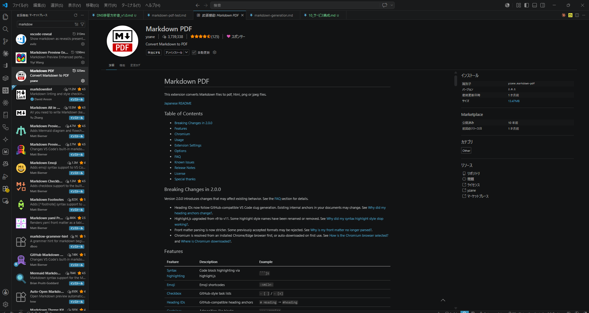
  <figcaption>FIGURE 2.　今回使った VS Code 拡張「Markdown PDF」（yzane.markdown-pdf）</figcaption>
</figure>

やりたいことは 3 つに絞りました。

<div class="shape-box shape-outline">
<ul>
<li><strong>派手にせず、長く使えるデザイン</strong> — <em>Swiss Modern Minimal</em> の流れで、グリッドと余白で見せる</li>
<li><strong>C4C ブランドを社内資料に統一する</strong> — マゼンタ + ニュートラルグレー + 漆黒インクの 3 色体系</li>
<li><strong>学習コストはゼロ</strong> — 書く側は何も覚え直さなくていい。普通の Markdown のままで OK</li>
</ul>
</div>

<div class="callout callout-tip">
<p><strong>Swiss Modern Minimal とは。</strong>ヘアライン罫・サンセリフ書体・厳密なグリッド・数学的な余白で構成されるデザイン手法。<em>新潮社や日経の書籍</em>、<em>無印良品の冊子</em>、<em>Apple の技術ドキュメント</em>などで使われている、上品で長く使えるスタイルです。</p>
</div>

この 3 点に絞って具体化したのが、次にご紹介する <span class="brand">markdown-c4c v3.0</span> の中身です。

<h2 id="sec-3">3. 作ったもの — markdown-c4c v3.0</h2>

##### COMPONENTS

中身はめちゃくちゃシンプルで、**1 枚の CSS ファイル** と、**VS Code の settings.json に貼り付ける数十行の設定スニペット**、それだけ。新しいツールも、独自記法も、専用エディタも、一切いりません。

<div class="callout callout-info">
<p><strong>構成。</strong>① 1 枚の <code>markdown-pdf.css</code>（Swiss Modern v3.0 のデザイントークンとコンポーネント定義）　② settings.json に貼る <code>markdown-pdf.*</code> 設定群（ヘッダ・フッタ・マージン・スタイルシートのパス指定）。これを置くだけで、既存の <code>.md</code> が <strong>すべて</strong>新しい見た目で PDF 化されるようになります。</p>
</div>

「やりたいこと 3 つ」を具体的なデザイントークンに落とし込むと、こんな構成になりました。

<div class="shape-box shape-outline">
<p><strong>v3.0 の構成要素</strong></p>
<ul>
<li><strong>タイポグラフィ</strong>: 見出し <code>Inter Tight</code>、本文 <code>Manrope</code>、等幅 <code>JetBrains Mono</code>、和文 <code>Hiragino Kaku Gothic ProN</code></li>
<li><strong>カラーシステム</strong>: ブランドマゼンタ（<code>#8A248C</code>）+ 8 段階のニュートラルグレー + 漆黒インク。アクセントは 1 ヶ所、本文は徹底的にモノトーン</li>
<li><strong>レイアウト</strong>: A4 / 余白 22mm、行間 1.65、見出し前後の vertical rhythm を 8pt グリッドに揃える</li>
<li><strong>コンポーネント</strong>: Callout 5 種・Shape Box 5 種・Divider 9 種・Table 5 種・TOC 1 種・インライン 6 種</li>
<li><strong>振る舞い</strong>: H2 自動改ページ、見出しクリック遷移、日本語禁則 (<code>line-break: strict</code>)、長文セル自動折返し</li>
</ul>
</div>

具体的にどんなものができるか、いくつか見ていきましょう。

<hr class="divider-morse">

### 表紙と目次

<figure>
  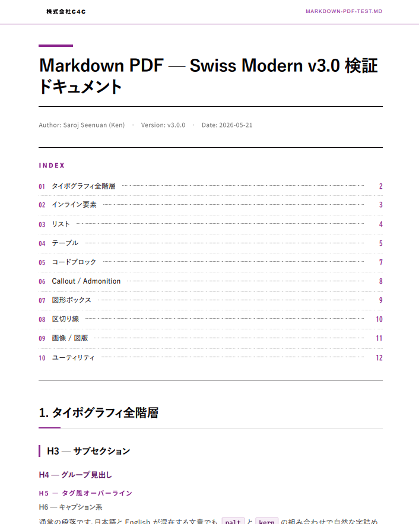
  <figcaption>FIGURE 3.　表紙にはタイトル + メタ情報、目次はドットリーダー付き。各項目をクリックすると該当セクションに直接ジャンプできる</figcaption>
</figure>

ヘッダの「株式会社C4C」とブランドカラーの縦バーで、**誰の資料か一目瞭然**。表紙には Author / Version / Date / 組織名のメタ情報がきれいに整列していて、提案書として外に出しても恥ずかしくない佇まいに仕上がります。

目次はドットリーダーで上品に、項目番号はブランドカラー。VS Code 上でも PDF 上でも **クリックで該当セクションに飛べる**ので、長い資料でもストレスなく目的の章にたどり着けます。

<div class="callout callout-tip">
<p><strong>目次設計の小さなこだわり。</strong>初期バージョンではページ番号を併記していたんですが、Markdown PDF の仕様上、出力時のページ数は<mark>実 PDF と必ずズレる</mark>ことがわかったため、v3.0 では <strong>ページ番号を表示しない方針</strong>に切り替えました。クリック遷移が効くので、紙ではなく画面で読む前提なら、これで十分実用的です。</p>
</div>

<hr class="divider-dot">

### テーブル

<figure>
  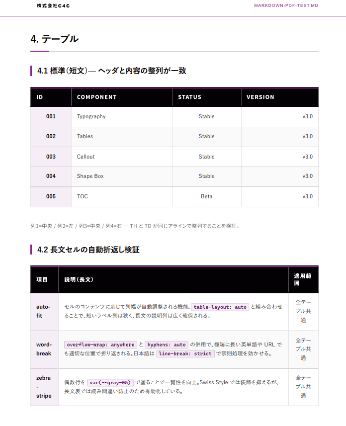
  <figcaption>FIGURE 4.　テーブルは 4 辺全枠線 + ブランド色ヘッダ。第 1 列は固定背景、偶数行は zebra-stripe で読み間違い防止</figcaption>
</figure>

提案書・見積書・仕様書、どんなビジネス文書を作っても **必ず使う**のがテーブル。だから一番気合を入れて設計しました。デフォルトは 4 辺全枠線 + ブランド色ヘッダ。ヘッダ行はマゼンタの薄いタイント背景に、本文より少しだけ太いウェイトの文字。第 1 列だけ淡いグレー背景にすることで、行ラベルが本文と自然に区別できるようにしてあります。

zebra-stripe（偶数行に淡いグレー）も入れていて、横長の表でも視線が行をスキップしないように設計。罫線は **0.5pt のヘアライン**で、太すぎず、消えすぎずの絶妙な濃度に調整しています。

<div class="callout callout-info">
<p><strong>テーブルのこだわり。</strong>長文セルが入っても自動で折り返すように、<code>overflow-wrap: anywhere</code> と <code>hyphens: auto</code> と日本語禁則 <code>line-break: strict</code> を併用しています。あと、ヘッダの中央寄せ・右寄せ指定が <strong>TH と TD で必ず一致</strong>するようにしました（GFM だと TH と TD でズレるバグ、地味に多いやつ）。</p>
</div>

さらに、用途に応じてバリエーションも 5 種類用意しました:

| クラス | 用途 |
|:---|:---|
| `with-v-lines` | 縦罫を出したい時。数値比較表など |
| `compact` | 長文テーブル。行間を詰めて密度を上げる |
| `jp` | 日本語専用。<code>keep-all</code> で単語途中折返しを回避 |
| `table-wrap` | 横スクロール許可。列が多い表用 |
| デフォルト | 通常の比較・分類表 |

<hr class="divider-dot-5">

### コードブロック

<figure>
  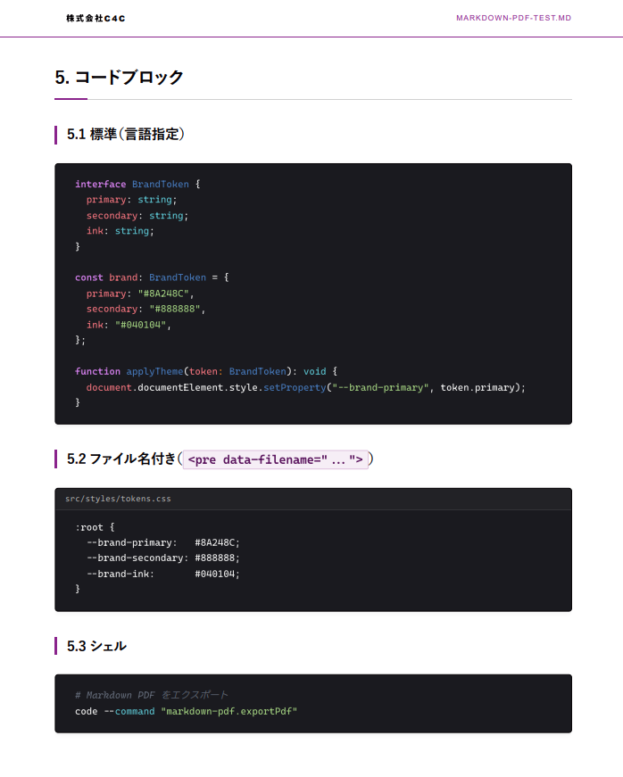
  <figcaption>FIGURE 5.　ダーク背景 + One Dark Pro 配色 + JetBrains Mono。ファイル名ヘッダも付けられます</figcaption>
</figure>

エンジニア向け資料を出すことが多いので、コードブロックは **VS Code エディタと同じ見た目**にこだわりました。配色は One Dark Pro、フォントは JetBrains Mono、行間は本文より少し詰めて 1.5。

紙面に黒い帯としてコードブロックが入ると、ドキュメント全体にメリハリが生まれます。Swiss Modern の白基調の中で、**コードブロックだけが意図的にダーク**というのが視覚的なアクセントになっている。

<pre data-filename="example.ts"><code>// ファイル名バー付きで出力できる
export function greet(name: string): string {
  return `Hello, ${name}!`;
}</code></pre>

ファイル名を `<pre data-filename="...">` で指定すれば、上のようにコードブロックの上にファイル名バーが自動で出ます。複数ファイルにまたがるコード例を見せる時に、どのファイルの話をしているかが一目でわかる。地味ですが、技術ドキュメントだとこれが本当に効きます。

<div class="callout callout-note">
<p><strong>言語シンタックスハイライト。</strong>markdown-it-prism を使っていて、TypeScript / JavaScript / Python / Go / Rust / Java / C# / SQL / Bash / YAML / JSON / HTML / CSS など主要 30 言語に対応。ハイライトは <code>```typescript</code> のように言語タグを付けるだけで自動適用されます。</p>
</div>

<hr class="divider-dot-brand">

### Callout（5 種類）

<figure>
  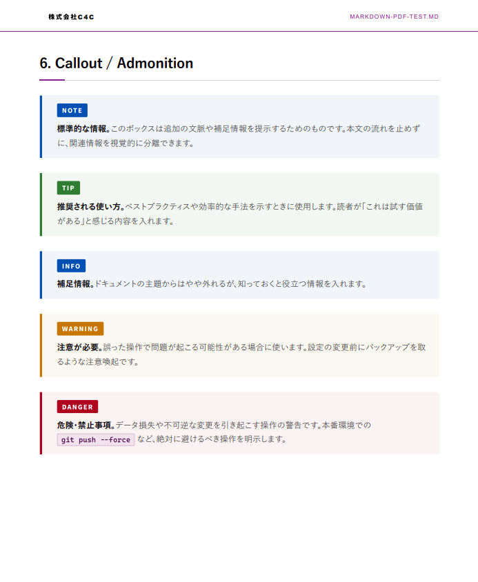
  <figcaption>FIGURE 6.　NOTE / TIP / INFO / WARNING / DANGER の 5 色。GitHub の `> [!NOTE]` 構文にも対応</figcaption>
</figure>

「ここ重要！」を強調したいとき、ただ太字にするより全然伝わります。**ラベル付きで色分けされている**ので、ドキュメントを流し読みしている人の目にも自然に飛び込んでくる。

5 種類を用途で使い分けます:

- <strong style="color:#3b82f6">NOTE</strong>（青）— 通常の情報・補足説明
- <strong style="color:#10b981">TIP</strong>（緑）— ベストプラクティス・推奨事項
- <strong style="color:#06b6d4">INFO</strong>（シアン）— 参考情報・関連リンク
- <strong style="color:#f59e0b">WARNING</strong>（橙）— 注意喚起・落とし穴
- <strong style="color:#ef4444">DANGER</strong>（赤）— 危険・禁止事項

GitHub Flavored Markdown の `> [!NOTE]` 記法にも対応しているので、GitHub で表示しても PDF で出しても、同じ意味の Callout が表示されます。**GitHub と PDF の見た目を行き来できる**のは、エンジニア向けドキュメントだと結構ありがたい。

<div class="callout callout-warning">
<p><strong>使いすぎ注意。</strong>Callout は強い視覚要素なので、1 ページに 3 個以上入れると逆にどれも目立たなくなります。1 セクションに 1〜2 個、本当に大事なところに絞って使うのが鉄則です。</p>
</div>

<hr class="divider-dot-line">

### 区切り線（9 種類）

<figure>
  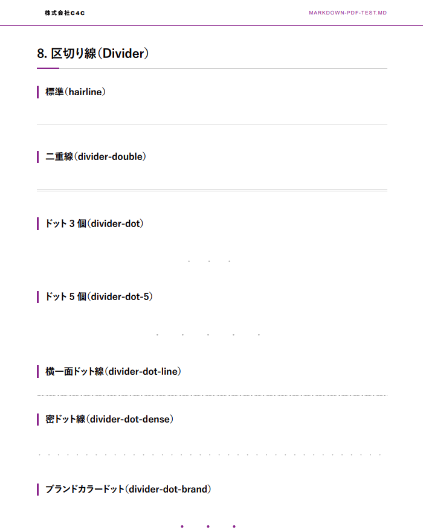
  <figcaption>FIGURE 7.　区切り線は 9 種類。セクション間で変えるとリズムが生まれる</figcaption>
</figure>

地味だけど、これが効きます。

長い文書を読んでいて疲れる原因のひとつが、**視覚的な単調さ**。文字・文字・文字…とずっと続くと、どこで小休止していいか分からなくなる。そこで小さな区切り線を**種類を変えながら**配置すると、読み手の視線に自然なリズムが生まれます。

9 種類のラインナップ:

| 種類 | 印象 | 使いどころ |
|:---|:---|:---|
| `<hr>` | 標準ヘアライン | 通常の区切り |
| `divider-double` | 二重線 | やや強めの区切り |
| `divider-dot` | ドット 3 個 | 控えめな視覚アクセント |
| `divider-dot-5` | ドット 5 個 | やや横長のアクセント |
| `divider-dot-line` | 横一面ドット | 軽やかな水平線 |
| `divider-dot-dense` | 密ドット | 細かい区切り |
| `divider-dot-brand` | ブランド色ドット | ブランド要素の挿入 |
| `divider-morse` | モールス風 | 装飾的・遊び心 |
| `divider-brand` | 中央菱形 | 章末締めくくり |

全部同じ `<hr>` で済ませると単調になるので、**直前のと違う種類**を選ぶようにすると、ドキュメント全体の質感がぐっと上がります。

<hr class="divider-dot-dense">

### 画像 + 説明（個人的お気に入り）

<figure>
  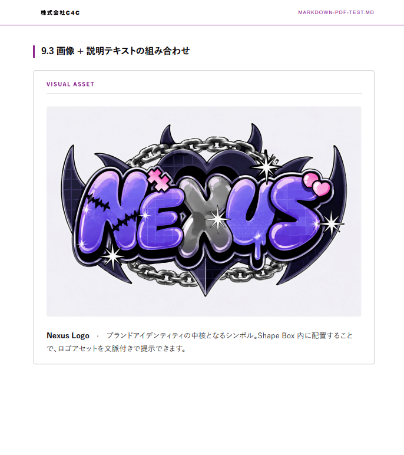
  <figcaption>FIGURE 8.　Shape Box の中に画像 + 説明テキストを入れるパターン。ロゴアセットの提示などに最適</figcaption>
</figure>

これ、地味に便利です。

ただ画像だけポンと貼るのではなく、**ボックスの中にタイトルラベル + 画像 + 説明文をセット**にすることで、「何のための画像なのか」を文脈付きで伝えられる。

```html
<div class="shape-box" data-title="VISUAL ASSET">
  
  <p>ブランドロゴ A 版。提案書表紙・名刺・名乗りに使用。</p>
</div>
```

ロゴアセットの提示、デザインカンプの紹介、Before / After の比較、UI スクリーンショットの解説 — どれも **画像だけだと意図が伝わりにくい**ものに、このパターンを使うと一気に説得力が増します。

<div class="callout callout-tip">
<p><strong>Ken のお気に入り。</strong>正直、このスキルで一番気に入っている要素がこれです。提案書で「ここ見て！」と言いたいビジュアルは、必ずこの形式で出すようにしています。タイトルラベル（<code>data-title</code>）が小さなカテゴリチップになっていて、視覚的に「これは資料の中の特別な要素ですよ」と訴えかけてくる。</p>
</div>

<hr class="divider-brand">

ここまでがコンポーネントの紹介。これらをぜんぶ合わせて、実際の Markdown を PDF にするとどうなるのか。**次のセクションで、Before / After の実物**を並べて見せます。

<h2 id="sec-4">4. Before / After — コードを変えずに PDF だけが化ける</h2>

##### IMPACT

ここがいちばん見せたかったところです。
**Markdown のソースコードは一行も変えていません**。CSS と設定を入れ替えただけで、PDF の見た目だけが全面的に変わりました。

<div style="display:flex; gap:16px; align-items:flex-start; margin:16px 0;">
  <div style="flex:1; display:flex; flex-direction:column; gap:12px;">
    <div style="text-align:center; font-weight:600; font-size:0.9em; padding:4px; border-bottom:1px solid #ccc;">【導入前】デフォルト出力</div>
    
  </div>
  <div style="flex:1; display:flex; flex-direction:column; gap:12px;">
    <div style="text-align:center; font-weight:600; font-size:0.9em; padding:4px; border-bottom:1px solid #8A248C; color:#8A248C;">【導入後】markdown-c4c 適用</div>
    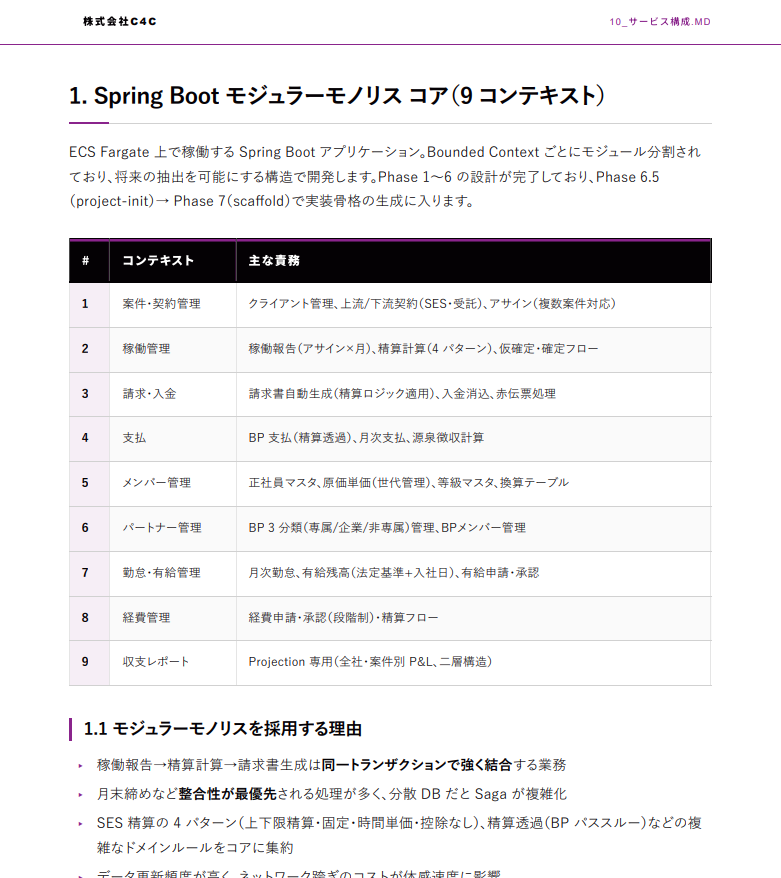
  </div>
</div>

<p class="caption center">FIGURE 9.　同じ Markdown ファイルを、設定を変える前と後で PDF 化した比較。<br>左カラムが導入前、右カラムが導入後（markdown-c4c 適用版）。</p>

<div class="callout callout-tip">
<p><strong>ここがすごい。</strong>既存の <code>.md</code> ファイル、たくさんあると思います。<mark>あれを全部、一括で見た目アップグレード</mark>できるということです。原稿を書き直す必要はありません。VS Code で開いて、<code>Markdown PDF: Export (pdf)</code> を押すだけ。</p>
</div>

<h2 id="sec-5">5. セットアップ — 5 分で導入</h2>

##### SETUP

導入は 3 ステップで終わります。

### Step 1. VS Code 拡張をインストール

<figure>
  
  <figcaption>FIGURE 10.　VS Code Marketplace で「Markdown PDF」を検索してインストール（yzane.markdown-pdf）</figcaption>
</figure>

<hr class="divider-dot">

### Step 2. settings.json にカスタム設定を追加

設定ファイルを開きます。

<figure>
  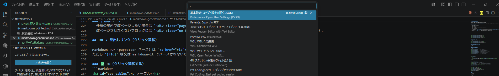
  <figcaption>FIGURE 11.　コマンドパレットで「Preferences: Open User Settings (JSON)」を開く</figcaption>
</figure>

そこに、`markdown-c4c` の設定スニペットを貼り付けます。
スタイルシートのパス、ヘッダ・フッタのテンプレート、マージンなどがまとめて入ります。

<figure>
  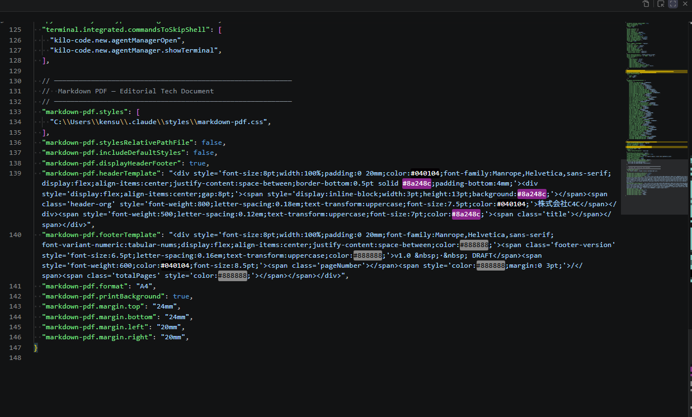
  <figcaption>FIGURE 12.　settings.json に貼り付ける markdown-pdf.* 設定（GitHub の README からコピー可能）</figcaption>
</figure>

<div class="callout callout-warning">
<p><strong>注意点。</strong><code>markdown-pdf.styles</code> のパスは <strong>自分のユーザーホームに合わせて</strong>書き換えてください。例えば Windows なら <code>C:\Users\YourName\.claude\styles\markdown-pdf.css</code>。</p>
</div>

<hr class="divider-dot">

### Step 3. Markdown を PDF にエクスポート

任意の `.md` を VS Code で開いて、コマンドパレットから `Markdown PDF: Export (pdf)` を実行するだけ。

<figure>
  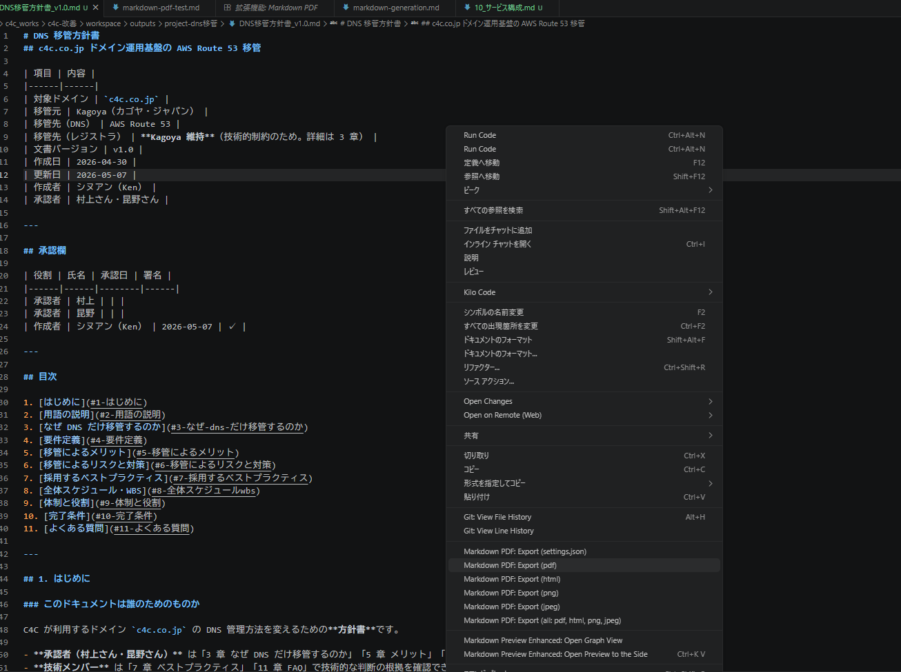
  <figcaption>FIGURE 13.　コマンドパレットで「Markdown PDF: Export (pdf)」を実行</figcaption>
</figure>

<div class="callout callout-tip">
<p><strong>これだけ。</strong>あとは同じフォルダに PDF が出力されます。設定さえ済んでしまえば、毎回やる作業は <strong>エクスポートコマンドを叩くだけ</strong>。</p>
</div>

<h2 id="sec-6">6. 使い方 — 書く側は何も変わらない</h2>

##### DAILY FLOW

前のセクションでセットアップが済んだ前提で、**普段の書く体験**がどう変わるかをご紹介します。結論から言うと、書く側でやることはほぼ普通の Markdown と変わりません。

Claude に「Markdown でドキュメント作って」とお願いすると、自動で markdown-c4c のルールに沿った Markdown が生成されます。

<figure>
  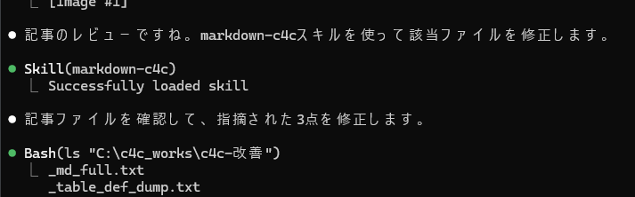
  <figcaption>FIGURE 14.　スラッシュコマンドを使わなくても、Claude が文脈を判断して markdown-c4c スキルを自動で呼び出している様子（<code>Skill(markdown-c4c)　Successfully loaded skill</code> のログが見える）</figcaption>
</figure>

<hr class="divider-morse">

生成された Markdown はこんな感じになります。普通の Markdown ですが、所々で `<div class="callout">` などの HTML タグを使って装飾を加えています。

<figure>
  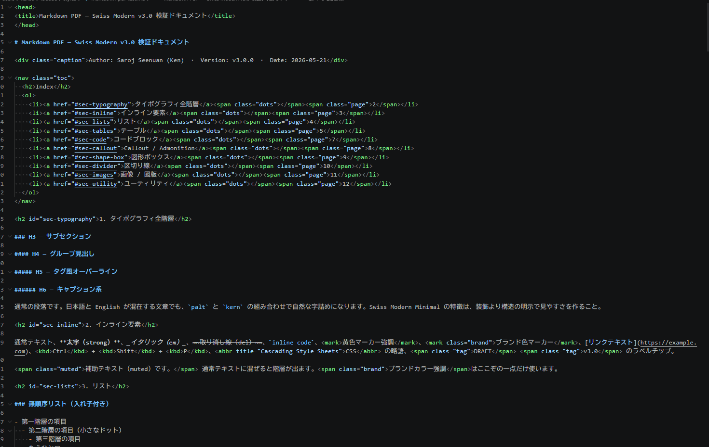
  <figcaption>FIGURE 15.　Claude が生成した Markdown ファイル。基本は普通の Markdown 構文で、Callout や Shape Box など装飾が必要な箇所だけ <code>&lt;div class="callout"&gt;</code> のような HTML タグが差し込まれている。書き手は普段の Markdown 知識のままで OK</figcaption>
</figure>

<hr class="divider-double">

そして VS Code でこの Markdown を開いて PDF エクスポートします。右クリックメニューから <code>Markdown PDF: Export (pdf)</code> を選ぶだけ。

<figure>
  
  <figcaption>FIGURE 16.　VS Code でエディタ上を右クリック →「Markdown PDF: Export (pdf)」を選択。ショートカット派の人はコマンドパレットから同じコマンドを実行しても OK</figcaption>
</figure>

実行すると、同じフォルダに PDF が出力されます。

<h2 id="sec-7">7. 社内展開と今後</h2>

##### CURRENT & FUTURE

### 現状: すでに OSS 公開済み

この markdown-c4c、実は <mark class="brand">すでに GitHub で OSS 公開</mark> しています。社内メンバーは誰でもインストールできるようにしてあって、インストールスクリプトも Windows / macOS / Linux 別々に用意済み。コマンド 1 行で導入できます。

<div class="shape-box" data-title="GITHUB REPOSITORY">
<p><strong>SarojSeenuan/skill-markdown-c4c</strong></p>
<p>https://github.com/SarojSeenuan/skill-markdown-c4c</p>
<p><span class="muted">README に各 OS 用のインストール方法が記載されています。CSS だけ欲しい人は <code>skill/assets/markdown-pdf.css</code> をダウンロードしてもOK。</span></p>
</div>

<hr class="divider-brand">

### 今後の 3 つの展開

<div class="callout callout-info">
<p><strong>1. 社内全員への展開。</strong>提案書・議事録・設計書・報告書、すべてこのテンプレートで統一していきたい。Word や PowerPoint で見た目を作り込む時間を、本来の中身を考える時間に振り向けたい。</p>
</div>

<div class="callout callout-tip">
<p><strong>2. 他プロジェクトへの転用。</strong>ブランドカラーは CSS の <code>:root</code> 内 3 行を差し替えるだけで変えられます。クライアント案件で「相手のブランド色で資料を作りたい」というケースにも、5 分で対応可能。</p>
</div>

<div class="callout callout-note">
<p><strong>3. テンプレート集の整備。</strong>提案書・議事録・週報など、用途別のスタータードキュメントを揃えていく予定。「白紙から書き始める」のコストをゼロにする。</p>
</div>

<hr>

### 最後に

AI で資料を書く機会は、これからもっと増えると思います。
だからこそ、<mark>出力の見た目をブランド統一しておく価値</mark>は大きい。

書き手は中身に集中できて、読み手はストレスなく読める。
そういう仕組みを、今後も改善しながら社内に広げていきたいなと思っています。

<h2 id="sec-8">8. v5.1.0 までの進化（追記）</h2>

本記事の初版は v3.0 リリース直後の話でした。 そこから 2026 年 5 月までに、 markdown-c4c は v5.1.0 まで進化しています。 主な変化を時系列でまとめると以下のとおり。

| バージョン | 主な進化 |
|:---|:---|
| v3.4.0 | API Blueprint / Stat Card 刷新 / グラフコンポーネント拡充 / JP Fix 句読点ルール |
| v3.5.0 | OSS 化 / 個人情報除去 / ZIP ビルドスクリプト / 表紙テンプレ + 締めページ 4 パターン / SKILL.md 自己充足型 |
| v4.0.0 | cover / closing デザイン全面刷新 / フォント体系引き上げ / コンテンツ密度ルール / Q&A ワークフロー導入 |
| v5.0.0 | ドキュメント種別テンプレート全廃 / Q&A 必須化 / cover-mark + cover-footer 撤去 / reference.md を参考スニペット集に格下げ |
| v5.0.3 | closing-contact / closing-cta を Editorial スタイルに再設計（左寄せ大型タイポ + 円形ブランドカラーアイコン） |
| v5.0.4 | 円形 SVG アイコンバッジ標準化（5.19）/ closing-contact の contact-label を SVG アイコンに置換 |
| **v5.1.0（本記事執筆時点）** | 判断ガイド集として reference.md 全面再設計 / SKILL.md セクション 3.0 を 5 フェーズ Q&A ワークフローに拡張 / ロゴ画像配置案内ルール（3.5）新設 / コンポーネント見出し日本語化 / skill/references ミラー新設 |

v5.1.0 でやっと「**Claude がユーザーと対話しながら、毎回違う構成のドキュメントを作れる**」状態になりました。 テンプレート量産時代から、判断インフラ時代へ。 この記事を読んでくれた人がいたら、ぜひ最新版を試してみてください。

<div class="closing-page closing-message">
  <p class="closing-thanks">最後までご覧いただき、誠にありがとうございました。</p>
  <p class="closing-credo">「カタチ」に残すだけじゃない、<br>「ココロ」に残る仕事を。</p>
  <p class="closing-org">株式会社C4C</p>
</div>
