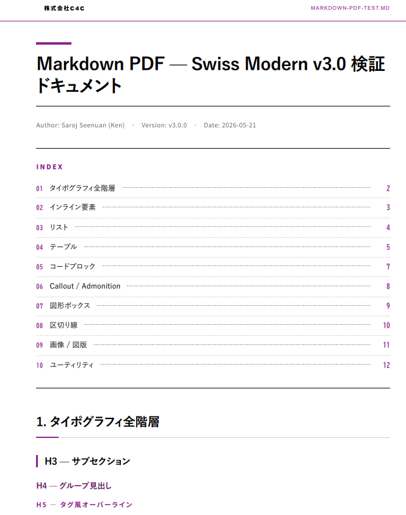
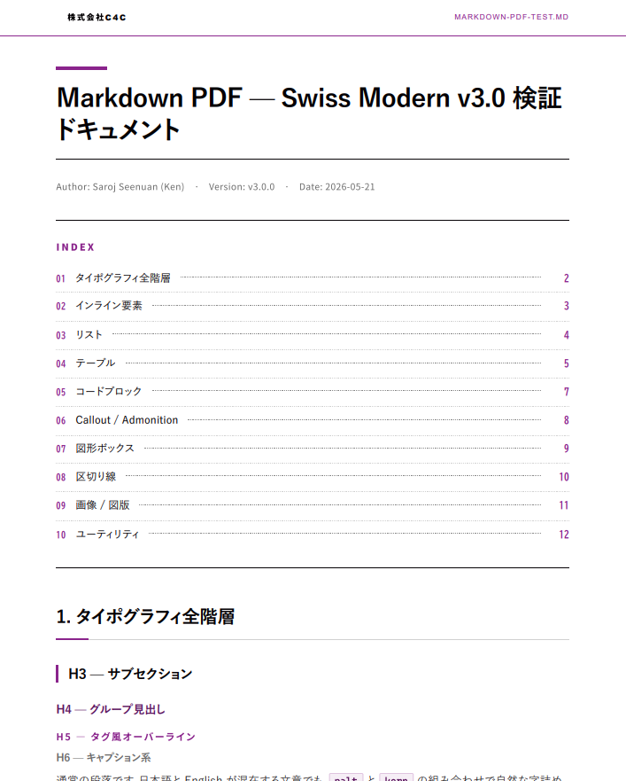

# Component Gallery — skill-markdown-c4c v3.0

全コンポーネントの実 PDF レンダリング結果。

---

## 03 · TOC Detail

目次の番号付け（decimal-leading-zero）、ドットリーダー、ページ番号右寄せ。

---

## 04 · TOC Alternate Layout

代替レイアウトでの目次表示。

---

## 05 · Table System

4 辺全枠線デフォルト + ブランド色ヘッダ + 第 1 列固定背景 + zebra stripe + アラインメント継承（TH/TD 同期）。
長文セルは `overflow-wrap: anywhere` + `hyphens: auto` + `line-break: strict` で自動折返し。

---

## 06 · Code Block

ダーク背景 + One Dark Pro 配色 + ファイル名ヘッダ（`<pre data-filename="...">`）+ JetBrains Mono フォント。

---

## 07 · Divider 9 Variants

`
` / `divider-double` / `divider-dot` / `divider-dot-5` / `divider-dot-line` / `divider-dot-dense` / `divider-dot-brand` / `divider-morse` / `divider-brand`。

---

## 08 · Image + Shape Box（推奨形式）

`
` で画像 + 説明テキストを組み合わせるパターン。
重要なビジュアルは必ずこの形式で。
