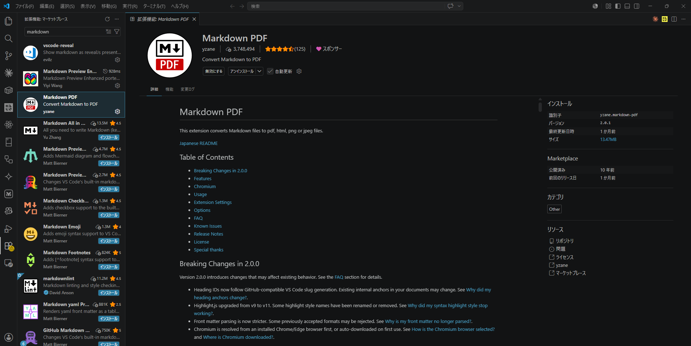
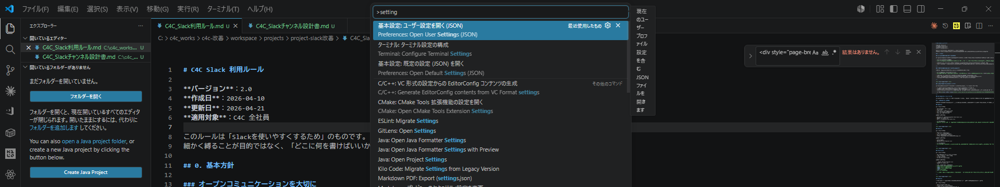
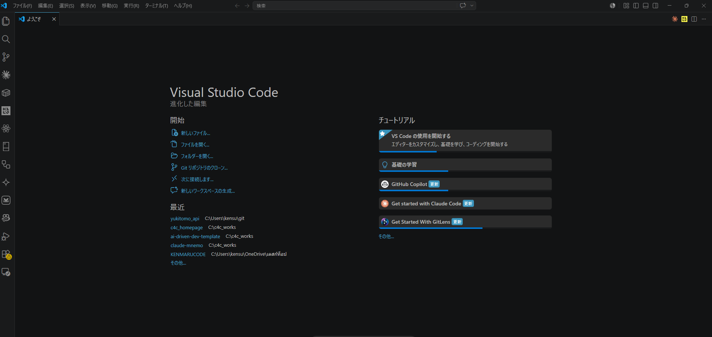

<head>
<title>markdown-c4c PDF セットアップガイド</title>
</head>

# markdown-c4c PDF セットアップガイド

<div class="caption">対象: 初めて VS Code + Markdown PDF を使う方　·　所要時間: 約 15 分　·　対応 OS: Windows / macOS / Linux</div>

このガイドは、Claude Web で生成した Markdown を **株式会社C4C ブランド PDF** に変換できる環境を、ゼロから作るための手順書。

Word や PowerPoint しか触ったことがなくても進められるよう、画面キャプチャ付きでひとつずつ説明する。Windows / macOS / Linux のいずれでも動作する。

<nav class="toc toc-no-page">
  <h2>Index</h2>
  <ol>
    <li><a href="#sec-prep">事前準備</a></li>
    <li><a href="#sec-install-vscode">VS Code をインストール</a></li>
    <li><a href="#sec-install-extension">Markdown PDF 拡張を入れる</a></li>
    <li><a href="#sec-settings">settings.json を設定する</a></li>
    <li><a href="#sec-place-css">CSS ファイルを配置する</a></li>
    <li><a href="#sec-test">テスト出力</a></li>
    <li><a href="#sec-trouble">トラブルシュート</a></li>
  </ol>
</nav>

<h2 id="sec-prep">1. 事前準備</h2>

##### CHECKLIST

セットアップに必要なものは以下の 3 つ。

- [ ] PC（Windows 10/11 · macOS 12+ · Linux 主要ディストリビューションのいずれか）
- [ ] インターネット接続（VS Code と拡張機能のダウンロード用）
- [ ] このパッケージ一式（`markdown-c4c-web-v1.0.0`）

<div class="callout callout-info">
<p><strong>OS による違い。</strong> 手順そのものは 3 OS で共通。 違うのはファイルパスの書き方と一部ショートカットだけ。 該当箇所では OS 別に併記する。</p>
</div>

<h2 id="sec-install-vscode">2. VS Code をインストール</h2>

### 2.1 ダウンロード

公式サイト [https://code.visualstudio.com/](https://code.visualstudio.com/) を開くと、アクセスしている OS 用のダウンロードボタンが自動で表示される。 そのままクリックしてインストーラを取得。

| OS | インストーラ |
|:---|:---|
| Windows | `VSCodeUserSetup-x64-*.exe` |
| macOS | `VSCode-darwin-*.zip`（Apple Silicon / Intel） |
| Linux | `.deb` / `.rpm` / `.tar.gz`（ディストリビューション別） |

画面の指示に従ってインストール（既定値のままで OK）。

### 2.2 起動

インストール完了後、VS Code を起動する。初回起動の画面は以下のようになる。

<div class="shape-box" data-title="STEP 1 — VS CODE 起動画面">
<p></p>
<p><strong>確認ポイント。</strong>左サイドバーにアイコンが縦に並んでいるか。一番上が「エクスプローラー」、4 番目が「拡張機能（四角が 4 つ並んだアイコン）」になる。</p>
</div>

<h2 id="sec-install-extension">3. Markdown PDF 拡張を入れる</h2>

### 3.1 拡張機能タブを開く

左サイドバーの **拡張機能アイコン**（四角が 4 つ並んだ形）をクリック。 ショートカット:

| OS | ショートカット |
|:---|:---:|
| Windows / Linux | `Ctrl` + `Shift` + `X` |
| macOS | `Cmd` + `Shift` + `X` |

### 3.2 markdown-pdf を検索

検索ボックスに `markdown-pdf` と入力。 一覧の一番上に表示される **yzane 製の Markdown PDF** を選ぶ。

<div class="shape-box" data-title="STEP 2 — 拡張機能検索">
<p></p>
<p><strong>選ぶのは yzane 製のもの。</strong>類似名の拡張がいくつかあるが、yzane（作者名）のものが正解。緑色の `Install` ボタンを押すとインストールが始まる。</p>
</div>

<div class="callout callout-tip">
<p><strong>初回のみ時間がかかる。</strong>この拡張は内部で Chromium（PDF 生成エンジン）をダウンロードする。 初回 PDF 出力時に数百 MB のダウンロードが走るので、ネット環境のいい場所で実行するとスムーズ。</p>
</div>

<h2 id="sec-settings">4. settings.json を設定する</h2>

### 4.1 settings.json を開く

コマンドパレットを開く:

| OS | ショートカット |
|:---|:---:|
| Windows / Linux | `Ctrl` + `Shift` + `P` |
| macOS | `Cmd` + `Shift` + `P` |

`Preferences: Open User Settings (JSON)` と入力し、Enter を押す。

<div class="shape-box" data-title="STEP 3 — settings.json を開く">
<p></p>
<p><strong>"Open User Settings (JSON)" を選ぶ。</strong>「Open User Settings」だけだと別画面（GUI）が開いてしまうので、必ず "(JSON)" が付いている方を選ぶ。</p>
</div>

settings.json の実体ファイルは OS によって場所が違う:

| OS | settings.json のパス |
|:---|:---|
| Windows | `%APPDATA%\Code\User\settings.json` |
| macOS | `~/Library/Application Support/Code/User/settings.json` |
| Linux | `~/.config/Code/User/settings.json` |

### 4.2 設定を追記する

開いた `settings.json` に、同梱の `settings.json.sample` の中身を **追記** する。

<div class="callout callout-warning">
<p><strong>注意。</strong>既存の設定を消さないこと。`{` と `}` の中に、新しいキーをカンマ区切りで追加する形になる。</p>
</div>

具体的には以下のキーを追記:

- `markdown-pdf.styles`
- `markdown-pdf.stylesRelativePathFile`
- `markdown-pdf.includeDefaultStyles`
- `markdown-pdf.displayHeaderFooter`
- `markdown-pdf.headerTemplate`
- `markdown-pdf.footerTemplate`
- `markdown-pdf.format`
- `markdown-pdf.printBackground`
- `markdown-pdf.margin.top` / `.bottom` / `.left` / `.right`

完成イメージは以下。

<div class="shape-box" data-title="STEP 4 — settings.json 設定完了">
<p></p>
<p><strong>JSON フォーマットは厳密。</strong>カンマの位置、ダブルクォートの種類（必ず半角の "）に注意。エラーが出たら VS Code が赤い波線で教えてくれる。</p>
</div>

<hr class="divider-dot-line">

設定例の全文は `settings.json.sample`（このフォルダ内）を参照。 コピペで使える形式になっている。

<h2 id="sec-place-css">5. CSS ファイルを配置する</h2>

`settings.json` の `markdown-pdf.styles` で指定したパス通りに、CSS ファイルを配置する。

### 5.1 配置先フォルダを作る

| OS | 推奨配置パス |
|:---|:---|
| Windows | `C:\c4c_works\markdown-c4c\` |
| macOS | `~/c4c_works/markdown-c4c/` |
| Linux | `~/c4c_works/markdown-c4c/` |

エクスプローラー / Finder / シェルで上記フォルダを作成する。

### 5.2 CSS をコピー

このパッケージの `pdf-setup/markdown-pdf.css` を、上記フォルダに **そのまま** コピーする。 最終的に以下のパスに CSS が存在する状態にする:

| OS | 配置先 |
|:---|:---|
| Windows | `C:\c4c_works\markdown-c4c\markdown-pdf.css` |
| macOS | `~/c4c_works/markdown-c4c/markdown-pdf.css` |
| Linux | `~/c4c_works/markdown-c4c/markdown-pdf.css` |

### 5.3 settings.json の styles パスを書き換える

`settings.json.sample` は Windows パスをデフォルトにしている。 macOS / Linux の場合は `markdown-pdf.styles` の値を書き換える。

```jsonc
// Windows（デフォルト・バックスラッシュは \\ と二重にする）
"markdown-pdf.styles": [
  "C:\\c4c_works\\markdown-c4c\\markdown-pdf.css"
]

// macOS / Linux（ホームディレクトリの絶対パス、`/` で OK）
"markdown-pdf.styles": [
  "/Users/yourname/c4c_works/markdown-c4c/markdown-pdf.css"
]
```

<div class="callout callout-info">
<p><strong>パスのエスケープ。</strong>Windows のみ <code>\\</code> と二重にする必要がある（JSON 仕様）。 macOS / Linux は <code>/</code> のままで OK。 また <code>~</code>（チルダ展開）は使えないので、ホームディレクトリは絶対パスで書く。</p>
</div>

<h2 id="sec-test">6. テスト出力</h2>

### 6.1 テンプレートを開く

同梱の `assets/template-document.md` を VS Code で開く。

### 6.2 PDF にエクスポート

エディタ上で **右クリック** → `Markdown PDF: Export (pdf)` を選択。

<div class="shape-box" data-title="STEP 5 — PDF エクスポート">
<p></p>
<p><strong>4 種類の Export がある。</strong>`pdf` を選ぶ。`html` `png` `jpeg` もあるが、ブランドフォーマットは PDF 用に調整されているので PDF 一択。</p>
</div>

### 6.3 出力結果を確認

数秒〜数十秒で、同じフォルダに `template-document.pdf` が生成される。 開いて以下を確認:

<div class="shape-box" data-title="STEP 6 — 仕上がりサンプル">
<p></p>
<p><strong>確認ポイント。</strong>ヘッダ左に「株式会社C4C」、ブランドカラーのライン、Callout・Shape Box が美しくスタイリングされていれば成功。</p>
</div>

##### CHECKLIST

- [ ] 1 ページ目に表紙（cover-page）が出ている
- [ ] ヘッダ左に「株式会社C4C」が縦バー付きで表示されている
- [ ] ヘッダ下にマゼンタ色（`#8A248C`）の罫線がある
- [ ] フッタ左は空、フッタ右にページ番号
- [ ] Callout の 5 色（青・緑・水色・橙・赤）が出ている
- [ ] H2 セクションごとに改ページしている
- [ ] フォントが Inter Tight / Manrope / 和文ゴシックで読める

<div class="callout callout-tip">
<p><strong>すべて OK なら完了。</strong>あとは Claude Web で markdown-c4c スキルを使って Markdown を生成 → コピーして `.md` に貼り付け → PDF Export、の流れで日常運用できる。</p>
</div>

<h2 id="sec-trouble">7. トラブルシュート</h2>

| 症状 | 原因 | 対処 |
|:---|:---|:---|
| CSS が反映されない（白黒の素っ気ない PDF） | `markdown-pdf.styles` のパスが間違っている | settings.json を再確認。 Windows は `\\` の二重バックスラッシュ、macOS / Linux は絶対パスで `/` |
| 初回の PDF 出力で 1 分以上待たされる | Chromium の初回ダウンロード | そのまま待つ。 2 回目以降は数秒で終わる |
| 「ファイルが見つかりません」エラー | CSS ファイルが配置されていない | 配置先パスに `markdown-pdf.css` が存在するか確認 |
| ヘッダ・フッタが出ない | `displayHeaderFooter` が `false` | settings.json で `true` に変更 |
| 日本語が文字化け（Windows） | フォントが読み込めていない | Windows は游ゴシックが自動フォールバック。 Yu Gothic がない場合は MS Gothic で代替表示 |
| 日本語が文字化け（macOS） | フォントが読み込めていない | macOS は Hiragino 系がデフォルトで入っているので通常問題なし。 出ない場合は `~/Library/Fonts/` を確認 |
| 日本語が文字化け（Linux） | CJK フォントが入っていない | `sudo apt install fonts-noto-cjk` （Debian / Ubuntu）または同等パッケージで Noto Sans CJK を導入 |
| 改ページがおかしい | H2 以外で改ページしている | H1 ではなく H2 で各セクションを始めているか確認 |
| TOC のページ番号が実際とズレる | TOC に `<span class="page">` を書いている | `toc-no-page` クラスを必ず付けて、ページ番号は記載しない |

<hr class="divider-brand">

<p class="center muted">— セットアップ完了後の運用は <code>how-to-export.md</code> を参照 —</p>
